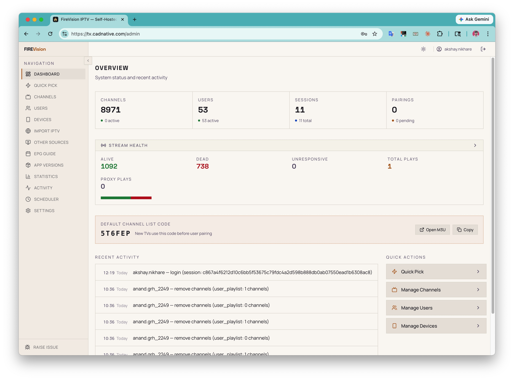
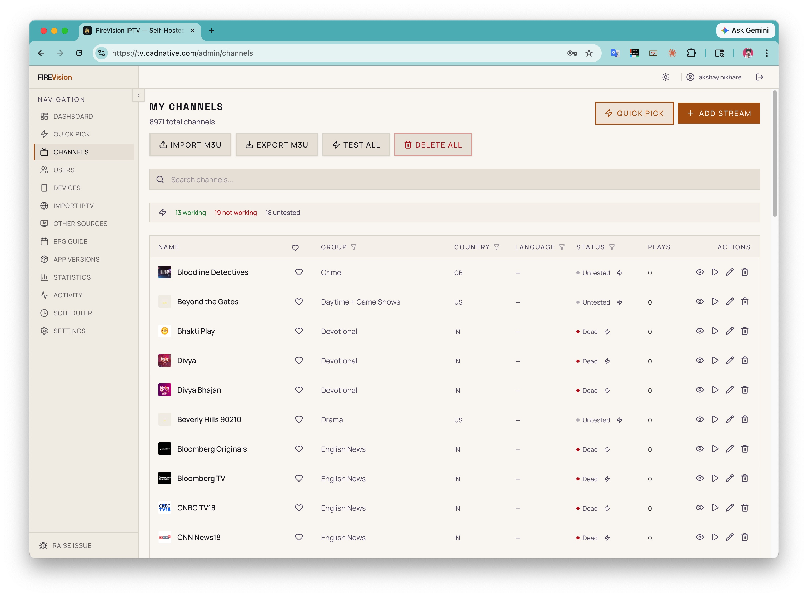
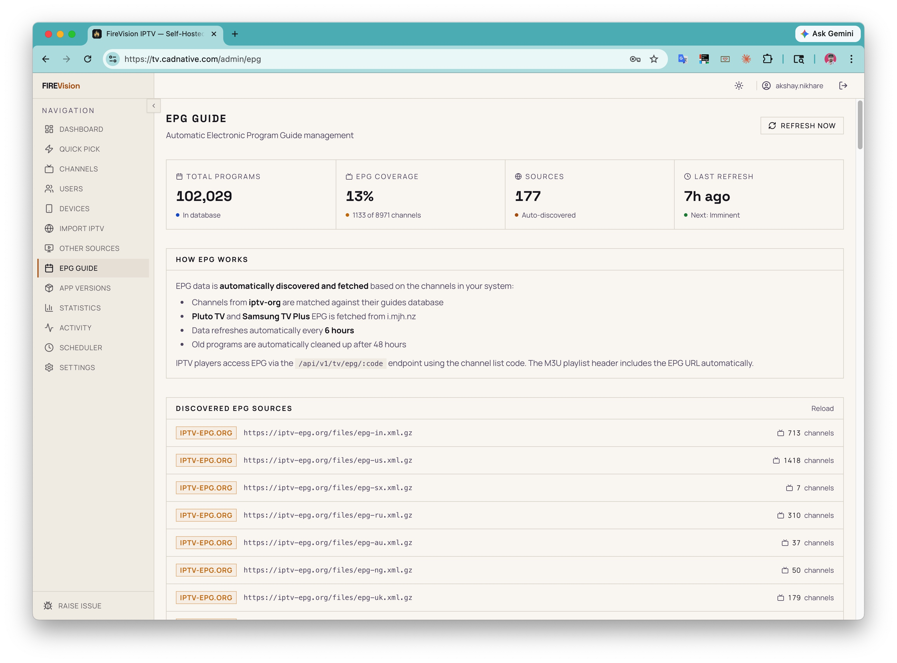
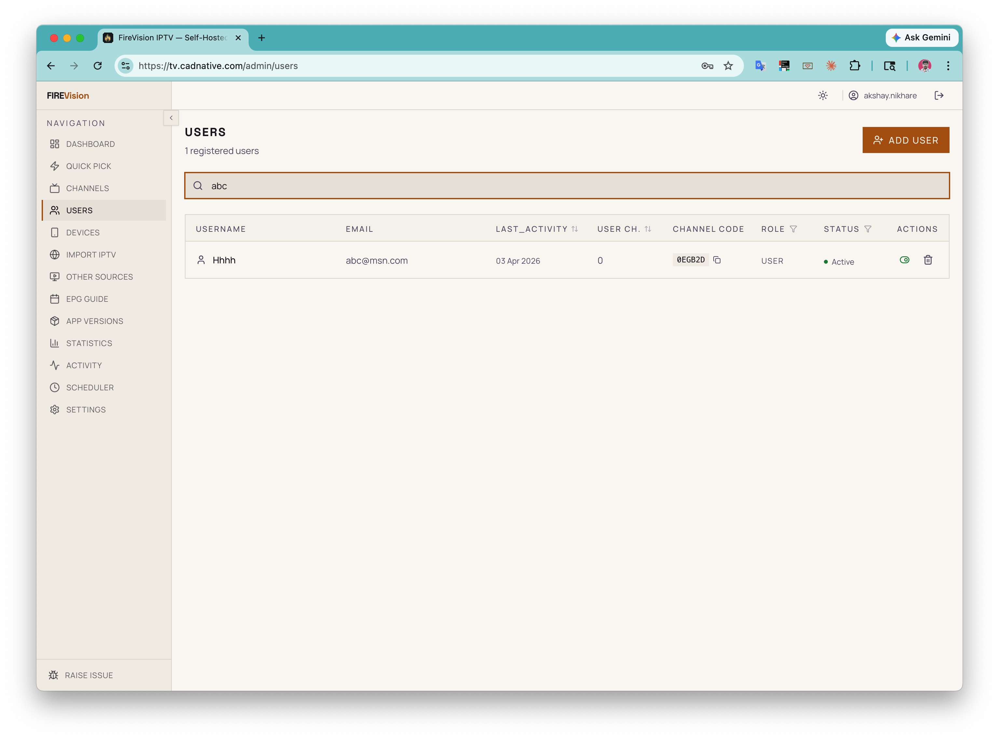
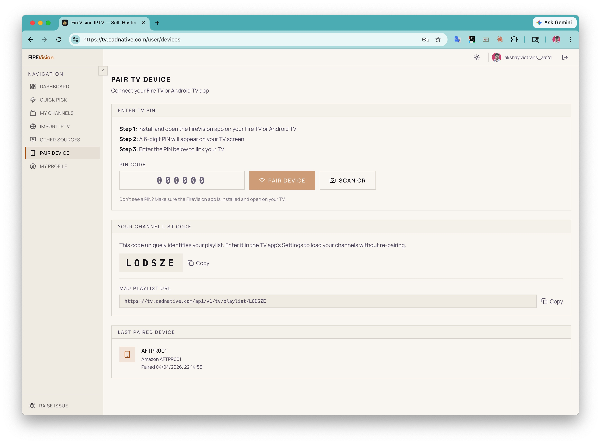
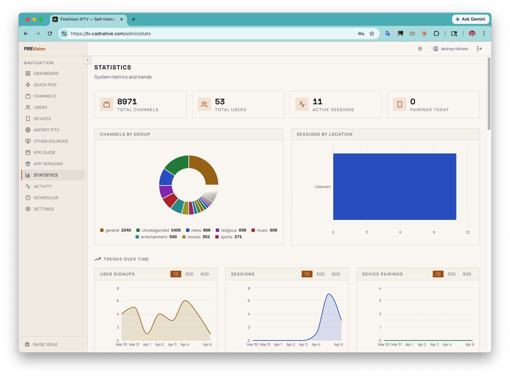

# FireVision IPTV Server

[](https://github.com/akshaynikhare/FireVisionIPTVServer/actions/workflows/docker-publish.yml)
[](https://github.com/akshaynikhare/FireVisionIPTVServer/actions/workflows/ci.yml)
[](https://github.com/akshaynikhare/FireVisionIPTVServer/releases/latest)
[](LICENSE)
[](https://github.com/akshaynikhare/FireVisionIPTVServer/pkgs/container/firevisioniptvserver)

**Self-hosted IPTV channel management platform.** Manage channels, users, EPG, and paired devices from a single admin panel — then stream directly to your Fire TV with the [companion Android app](https://github.com/akshaynikhare/FireVisionIPTV).

> Your server. Your channels. No subscriptions.

---

## Screenshots

| Admin Dashboard                                      | Channel Management                                     | EPG Guide                                |
| ---------------------------------------------------- | ------------------------------------------------------ | ---------------------------------------- |
|  |  |  |

| User Management                                  | Device Pairing                                    | Statistics                                  |
| ------------------------------------------------ | ------------------------------------------------- | ------------------------------------------- |
|  |  |  |

---

## Features

### Channel Management

- Import M3U playlists and external sources (Pluto TV, Samsung TV Plus)
- Smart stream grouping with auto-fallback to alternate streams
- Live health scanning — online/offline status per channel
- Bulk operations: enable, disable, reorder, delete
- Per-channel stream testing with latency and manifest metrics
- Global M3U playlist endpoint compatible with any IPTV player

### EPG & Programme Guide

- XMLTV EPG integration with scheduled auto-refresh
- Per-channel programme schedule synced to paired TV devices

### Device Pairing

- PIN-based pairing with QR code support
- TV app receives synced channel list, favorites, and health data in real time
- Legacy code-based pairing for older clients

### Admin Panel

- Full user management — create, deactivate, assign roles, reset passwords
- Role-based access control: Admin and User roles
- Statistics dashboard — channels, users, sessions, activity timeline, charts
- Scheduler control — liveness checks, EPG refresh, cache warm-up
- OTA app version management — push APK updates to all paired TV devices

### Auth & Security

- Session-based auth (primary) + JWT (API clients)
- OAuth2 sign-in with Google and GitHub
- Refresh token rotation, per-session revocation, force logout all devices
- Rate limiting, CORS, security headers

### Infrastructure

- One-command Docker Compose setup (dev + production)
- Redis caching with graceful fallback if unavailable
- Sentry error monitoring
- Transactional email via Brevo SMTP (MailHog in dev)
- Stream proxy and image proxy

---

## Quick Start

**Requirements:** Docker & Docker Compose, 2 GB RAM minimum

```bash
# 1. Clone and configure
git clone https://github.com/akshaynikhare/FireVisionIPTVServer.git
cd FireVisionIPTVServer
cp .env.example .env
```

Edit `.env` — at minimum set your admin credentials and JWT secrets:

```env
SUPER_ADMIN_USERNAME=admin
SUPER_ADMIN_PASSWORD=YourSecurePassword123!
SUPER_ADMIN_EMAIL=you@example.com

# Generate: node -e "console.log(require('crypto').randomBytes(32).toString('hex'))"
JWT_ACCESS_SECRET=<random-32-char-string>
JWT_REFRESH_SECRET=<different-random-32-char-string>
```

```bash
# 2. Start the full stack (API + frontend + scheduler + MongoDB + Redis)
docker compose up -d

# Admin panel → http://localhost:3001
# API         → http://localhost:3000
```

For production deployment, see [Self-Hosting Guide](docs/workflow/SELF_HOSTING_GUIDE.md).

---

x

## Architecture

```
┌──────────────┐     ┌──────────────┐
│  Android App │     │  Next.js     │
│  (Fire TV)   │     │  Frontend    │
└──────┬───────┘     └──────┬───────┘
       │                    │
       └────────┬───────────┘
                ▼
       ┌─────────────────┐
       │   Express API   │
       │  (TypeScript)   │
       └───┬─────────┬───┘
           │         │
           ▼         ▼
    ┌──────────┐ ┌────────┐
    │ MongoDB  │ │ Redis  │
    └──────────┘ └────────┘
```

## Tech Stack

|              |                                              |
| ------------ | -------------------------------------------- |
| **Backend**  | Express.js, TypeScript, Mongoose             |
| **Frontend** | Next.js 14, Tailwind CSS, shadcn/ui          |
| **State**    | TanStack Query + Zustand                     |
| **Database** | MongoDB 7                                    |
| **Cache**    | Redis 7 (optional — graceful fallback)       |
| **Auth**     | Session-based + JWT, OAuth2 (Google, GitHub) |
| **Testing**  | Jest, Supertest, Playwright (E2E)            |
| **CI/CD**    | GitHub Actions → Docker (GHCR) → Portainer   |

---

## Android Client

Pair with the [FireVision IPTV](https://github.com/akshaynikhare/FireVisionIPTV) app — open-source IPTV player for Amazon Fire TV and Android TV.

Features: HLS live streaming via ExoPlayer, D-pad navigation, server-synced favorites, background health scanning, OTA updates.

---

## Documentation

| Doc                                                       | Description                                  |
| --------------------------------------------------------- | -------------------------------------------- |
| [Self-Hosting Guide](docs/workflow/SELF_HOSTING_GUIDE.md) | Production Docker setup step-by-step         |
| [API Documentation](docs/API_DOCUMENTATION.md)            | All endpoints with request/response examples |
| [Architecture](docs/ARCHITECTURE.md)                      | System design and data flow                  |
| [Setup Guide](docs/workflow/SETUP_GUIDE.md)               | Local dev environment                        |
| [TV Pairing System](docs/workflow/TV_PAIRING_SYSTEM.md)   | How device pairing works                     |
| [Deployment Guide](docs/workflow/DEPLOYMENT_GUIDE.md)     | Tag-based auto-deploy via GitHub Actions     |
| [OAuth Setup](docs/workflow/OAUTH_SETUP.md)               | Google & GitHub OAuth configuration          |
| [Feature List](docs/FEATURE_LIST.md)                      | Complete feature inventory                   |

---

## Contributing

See [CONTRIBUTING.md](CONTRIBUTING.md). Issues and PRs welcome.

## License

[MIT](LICENSE)
