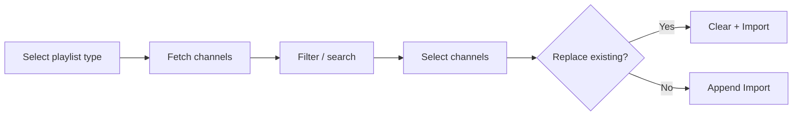

# Admin Dashboard

## Access

| Environment | URL                              |
| ----------- | -------------------------------- |
| Development | `http://localhost:8009/admin`    |
| Production  | `https://tv.cadnative.com/admin` |

Credentials: `SUPER_ADMIN_USERNAME` / `SUPER_ADMIN_PASSWORD` from `.env`.

## Features

| Feature            | Description                                                                               |
| ------------------ | ----------------------------------------------------------------------------------------- |
| Channel Management | CRUD operations, search/filter by name or category, bulk select/delete/test               |
| IPTV-org Import    | Fetch channels by country, category, or language. Selective import with optional replace. |
| Channel Testing    | HTTP HEAD probe per stream. Bulk or single test. 10s timeout per channel.                 |
| Statistics         | Channel counts (total/active/inactive), category distribution chart                       |
| Backup/Restore     | Export as M3U, database backup via mongodump, API-based restore                           |

## IPTV-org Import Flow



Playlists: All Channels, By Country, By Category, By Language. Source has thousands of channels — be selective.

## Channel Testing

- Sends HTTP HEAD request to each stream URL
- Success: HTTP 200-399 response
- Records response time (ms) and updates channel metadata
- Results: green = working, red = not accessible

## API Examples

### Auth

```bash
# Login — returns sessionId
curl -X POST http://localhost:8009/api/v1/auth/login \
  -H "Content-Type: application/json" \
  -d '{"username":"admin","password":"admin123"}'

# Use X-Session-Id header for all subsequent requests
```

### Channel Testing

```bash
# Test single channel
curl -X POST http://localhost:8009/api/v1/test/test-channel \
  -H "Content-Type: application/json" \
  -H "X-Session-Id: <session-id>" \
  -d '{"channelId":"<channel-id>"}'

# Test batch
curl -X POST http://localhost:8009/api/v1/test/test-batch \
  -H "Content-Type: application/json" \
  -H "X-Session-Id: <session-id>" \
  -d '{"channelIds":["id1","id2","id3"]}'
```

### IPTV-org

```bash
# List playlists
curl http://localhost:8009/api/v1/iptv-org/playlists \
  -H "X-Session-Id: <session-id>"

# Fetch playlist
curl "http://localhost:8009/api/v1/iptv-org/fetch?url=https://iptv-org.github.io/iptv/index.m3u" \
  -H "X-Session-Id: <session-id>"

# Import selected channels
curl -X POST http://localhost:8009/api/v1/iptv-org/import \
  -H "Content-Type: application/json" \
  -H "X-Session-Id: <session-id>" \
  -d '{"channels":[...],"replaceExisting":false}'
```

### Backup & Restore

```bash
# Export M3U
curl http://localhost:8009/api/v1/channels/playlist.m3u > backup.m3u

# Database backup
./scripts/manage.sh backup

# Restore via API
curl -X POST http://localhost:8009/api/v1/admin/channels/import-m3u \
  -H "Content-Type: application/json" \
  -H "X-Session-Id: <session-id>" \
  -d "{\"m3uContent\": \"$(cat backup.m3u)\", \"clearExisting\": true}"
```

## Troubleshooting

| Problem               | Fix                                                                           |
| --------------------- | ----------------------------------------------------------------------------- |
| Can't login           | Verify `.env` credentials, check `curl http://localhost:8009/health`          |
| Channels not loading  | Check `curl http://localhost:8009/api/v1/channels`, verify MongoDB is running |
| IPTV-org import fails | Try smaller playlist (by country), check server logs                          |
| Testing slow          | 10s timeout per channel. Test smaller batches.                                |
