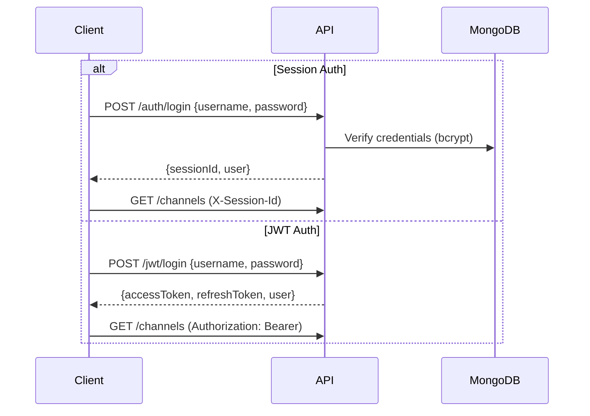

# API Documentation

**Base URL:** `http://localhost:3000/api/v1` (dev) | `https://tv.cadnative.com/api/v1` (prod)

## Conventions

**Auth:** All authenticated endpoints accept either header:

- `X-Session-Id: <session_id>` (session-based)
- `Authorization: Bearer <access_token>` (JWT)

**Response format:** All responses return `{ "success": true/false, ... }`. Errors include an `error` field.

**Rate limiting:** See [Rate Limiting](#rate-limiting) table at the bottom.



---

## Authentication Endpoints

### 1. Login

**POST** `/auth/login`

Authenticate user and create a session.

**Request Body:**

```json
{
  "username": "superadmin",
  "password": "ChangeMeNow123!"
}
```

**Response (200 OK):**

```json
{
  "success": true,
  "sessionId": "abc123def456...",
  "user": {
    "id": "64f7a8b9c1d2e3f4a5b6c7d8",
    "username": "superadmin",
    "email": "admin@firevision.local",
    "role": "Admin",
    "channelListCode": "ABC123",
    "isActive": true,
    "lastLogin": "2024-11-19T10:30:00.000Z"
  }
}
```

**Error Response (401 Unauthorized):**

```json
{
  "success": false,
  "error": "Invalid credentials"
}
```

---

### 2. Logout

**POST** `/auth/logout`

**Headers:** `X-Session-Id: <session_id>`

**Response (200 OK):**

```json
{
  "success": true,
  "message": "Logged out successfully"
}
```

---

### 3. Get Current User

**GET** `/auth/me`

**Headers:** `X-Session-Id: <session_id>`

**Response (200 OK):**

```json
{
  "success": true,
  "user": {
    "id": "64f7a8b9c1d2e3f4a5b6c7d8",
    "username": "superadmin",
    "email": "admin@firevision.local",
    "role": "Admin",
    "channelListCode": "ABC123",
    "isActive": true,
    "lastLogin": "2024-11-19T10:30:00.000Z",
    "channels": [],
    "metadata": {},
    "createdAt": "2024-01-01T00:00:00.000Z",
    "updatedAt": "2024-11-19T10:30:00.000Z"
  }
}
```

---

### 4. Change Password

**POST** `/auth/change-password`

**Headers:** `X-Session-Id: <session_id>`

**Request Body:**

```json
{
  "currentPassword": "OldPassword123!",
  "newPassword": "NewPassword456!"
}
```

**Response (200 OK):**

```json
{
  "success": true,
  "message": "Password changed successfully. Other sessions have been logged out."
}
```

---

### 5. Get All Sessions

**GET** `/auth/sessions`

Get all active sessions for the current user.

**Headers:** `X-Session-Id: <session_id>`

**Response (200 OK):**

```json
{
  "success": true,
  "sessions": [
    {
      "id": "64f7a8b9c1d2e3f4a5b6c7d8",
      "sessionId": "abc123def456...",
      "ipAddress": "192.168.1.100",
      "userAgent": "Mozilla/5.0...",
      "createdAt": "2024-11-19T10:00:00.000Z",
      "expiresAt": "2024-11-20T10:00:00.000Z",
      "lastActivity": "2024-11-19T10:30:00.000Z",
      "isCurrent": true
    }
  ]
}
```

---

### 6. Revoke Session

**DELETE** `/auth/sessions/:sessionId`

**Headers:** `X-Session-Id: <session_id>`

**Response (200 OK):**

```json
{
  "success": true,
  "message": "Session revoked successfully"
}
```

---

## JWT Authentication

### 1. JWT Login

**POST** `/jwt/login`

Authenticate user and receive JWT access and refresh tokens.

**Request Body:**

```json
{
  "username": "user",
  "password": "pass"
}
```

**Response (200 OK):**

```json
{
  "success": true,
  "tokens": {
    "accessToken": "eyJhbGciOiJIUzI1NiIs...",
    "refreshToken": "eyJhbGciOiJIUzI1NiIs..."
  },
  "user": {
    "id": "64f7a8b9c1d2e3f4a5b6c7d8",
    "username": "user",
    "email": "user@example.com",
    "role": "User",
    "channelListCode": "ABC123",
    "emailVerified": false
  }
}
```

**Note:** `username` may be a username or an email address.

---

### 2. Refresh Access Token

**POST** `/jwt/refresh`

Exchange (and rotate) a refresh token for a new access token and refresh token.

**Request Body:**

```json
{
  "refreshToken": "eyJhbGciOiJIUzI1NiIs..."
}
```

**Response (200 OK):**

```json
{
  "success": true,
  "accessToken": "eyJhbGciOiJIUzI1NiIs...",
  "refreshToken": "eyJhbGciOiJIUzI1NiIs..."
}
```

---

### 3. JWT Logout

**POST** `/jwt/logout`

Invalidate a refresh token.

**Request Body:**

```json
{
  "refreshToken": "eyJhbGciOiJIUzI1NiIs..."
}
```

**Response (200 OK):**

```json
{
  "success": true,
  "message": "Logged out successfully"
}
```

---

### 4. Get Current User (JWT)

**GET** `/jwt/me`

**Headers:** `Authorization: Bearer <access_token>`

**Response (200 OK):**

```json
{
  "success": true,
  "user": {
    "id": "64f7a8b9c1d2e3f4a5b6c7d8",
    "username": "user",
    "email": "user@example.com",
    "role": "User",
    "channelListCode": "ABC123",
    "isActive": true
  }
}
```

---

### 5. Get Playlist (JWT)

**GET** `/jwt/playlist.m3u`

Returns the authenticated user's M3U playlist.

**Headers:** `Authorization: Bearer <access_token>`

**Response (200 OK):**

```m3u
#EXTM3U
#EXTINF:-1 tvg-id="hbo-hd" tvg-name="HBO HD" tvg-logo="http://example.com/logos/hbo.png" group-title="Movies",HBO HD
http://example.com/stream/hbo.m3u8
```

---

## Public Signup

### 1. Register New Account

**POST** `/public/signup`

Create a new user account and receive JWT tokens. Rate limited to 10 requests per hour per IP. A verification email is sent; the account is created with `emailVerified: false`.

**Auth:** Not required

**Request Body:**

```json
{
  "username": "new_user",
  "email": "newuser@example.com",
  "password": "SecurePass123!"
}
```

**Response (201 Created):**

```json
{
  "success": true,
  "user": {
    "id": "64f7a8b9c1d2e3f4a5b6c7d8",
    "username": "new_user",
    "email": "newuser@example.com",
    "role": "User",
    "channelListCode": "XYZ789",
    "emailVerified": false
  },
  "tokens": {
    "accessToken": "eyJhbGciOiJIUzI1NiIs...",
    "refreshToken": "eyJhbGciOiJIUzI1NiIs..."
  }
}
```

---

### 2. Register (Session-based, reCAPTCHA)

**POST** `/auth/register`

Alternative registration that creates a session-backed account. When `GOOGLE_RECAPTCHA_SECRET_KEY` is configured, a Google reCAPTCHA v3 token is **required** and a score below the threshold blocks registration. A verification email is sent.

**Auth:** Not required (rate limited via the auth limiter)

**Request Body:**

```json
{
  "username": "new_user",
  "email": "newuser@example.com",
  "password": "SecurePass123!",
  "recaptchaToken": "03AGdBq26..."
}
```

- `recaptchaToken` (required only when reCAPTCHA is enabled server-side)

**Response (200 OK):**

```json
{
  "success": true,
  "message": "Registration successful. Please check your email to verify your account.",
  "user": {
    "id": "64f7a8b9c1d2e3f4a5b6c7d8",
    "username": "new_user",
    "email": "newuser@example.com",
    "channelListCode": "XYZ789",
    "emailVerified": false
  }
}
```

---

## Email Verification & Password Reset

| Method | Path                        | Auth    | Body                     | Purpose                                                                               |
| ------ | --------------------------- | ------- | ------------------------ | ------------------------------------------------------------------------------------- |
| POST   | `/auth/verify-email`        | Public  | `{ token }`              | Verify email using the token from the verification email                              |
| POST   | `/auth/resend-verification` | Session | —                        | Resend the verification email to the logged-in user                                   |
| POST   | `/auth/forgot-password`     | Public  | `{ email }`              | Request a password-reset link (always returns success to prevent account enumeration) |
| POST   | `/auth/reset-password`      | Public  | `{ token, newPassword }` | Reset password with the emailed token; invalidates all sessions                       |

---

## OAuth (Google / GitHub)

Two entry points exist. The `/auth/*` routes redirect back to `/login?oauth_code=<code>`, then the SPA exchanges the code via `POST /auth/oauth-exchange` (`{ code }`) for a `sessionId`. The `/oauth/*` routes return JWT tokens directly from the callback.

| Method | Path                                                | Auth   | Purpose                                                                      |
| ------ | --------------------------------------------------- | ------ | ---------------------------------------------------------------------------- |
| GET    | `/auth/google` / `/auth/github`                     | Public | Start OAuth (session flow); redirects to provider                            |
| GET    | `/auth/google/callback` / `/auth/github/callback`   | Public | Provider callback; redirects to `/login?oauth_code=<code>`                   |
| POST   | `/auth/oauth-exchange`                              | Public | Exchange one-time `code` (60s expiry) for `{ sessionId, user }`              |
| GET    | `/oauth/google/start` / `/oauth/github/start`       | Public | Start OAuth (JWT flow); redirects to provider                                |
| GET    | `/oauth/google/callback` / `/oauth/github/callback` | Public | Callback returns `{ provider, tokens: { accessToken, refreshToken }, user }` |

---

## User Management Endpoints

### 1. Get All Users

**GET** `/users`

**Auth Required:** Admin only
**Headers:** `X-Session-Id: <session_id>`

**Response (200 OK):**

```json
{
  "success": true,
  "count": 5,
  "data": [
    {
      "id": "64f7a8b9c1d2e3f4a5b6c7d8",
      "username": "john_doe",
      "email": "john@example.com",
      "role": "User",
      "channelListCode": "XYZ789",
      "isActive": true,
      "lastLogin": "2024-11-19T09:00:00.000Z",
      "channels": [
        {
          "channelName": "HBO",
          "channelGroup": "Movies"
        }
      ],
      "createdAt": "2024-01-15T00:00:00.000Z",
      "updatedAt": "2024-11-19T09:00:00.000Z"
    }
  ]
}
```

---

### 2. Create User

**POST** `/users`

**Auth Required:** Admin only
**Headers:** `X-Session-Id: <session_id>`

**Request Body:**

```json
{
  "username": "jane_doe",
  "password": "SecurePass123!",
  "email": "jane@example.com",
  "role": "User",
  "isActive": true
}
```

**Response (201 Created):**

```json
{
  "success": true,
  "message": "User created successfully",
  "data": {
    "id": "64f7a8b9c1d2e3f4a5b6c7d8",
    "username": "jane_doe",
    "email": "jane@example.com",
    "role": "User",
    "channelListCode": "DEF456",
    "isActive": true
  }
}
```

---

### 3. Get User by ID

**GET** `/users/:id`

**Auth Required:** Admin or own profile
**Headers:** `X-Session-Id: <session_id>`

**Response (200 OK):**

```json
{
  "success": true,
  "data": {
    "id": "64f7a8b9c1d2e3f4a5b6c7d8",
    "username": "jane_doe",
    "email": "jane@example.com",
    "role": "User",
    "channelListCode": "DEF456",
    "isActive": true,
    "channels": [],
    "lastLogin": null,
    "createdAt": "2024-11-19T10:00:00.000Z"
  }
}
```

---

### 4. Update User

**PUT** `/users/:id`

**Auth Required:** Admin or own profile
**Headers:** `X-Session-Id: <session_id>`

**Request Body:**

```json
{
  "username": "jane_smith",
  "email": "jane.smith@example.com",
  "password": "NewPassword123!",
  "role": "Admin",
  "isActive": false
}
```

**Note:** Only admins can change `role`, `isActive`, and `allCatalog`. Non-admins cannot change `password` here (use `/auth/change-password`). Setting `allCatalog: true` (admin-only) serves the user the entire shared catalog (capped at `TV_CHANNELS_MAX`) instead of their `channels` selection. Role changes are recorded as a dedicated security audit entry.

**Response (200 OK):**

```json
{
  "success": true,
  "message": "User updated successfully",
  "data": {
    "id": "64f7a8b9c1d2e3f4a5b6c7d8",
    "username": "jane_smith",
    "email": "jane.smith@example.com",
    "role": "Admin",
    "isActive": false
  }
}
```

---

### 5. Delete User

**DELETE** `/users/:id`

**Auth Required:** Admin only
**Headers:** `X-Session-Id: <session_id>`

**Response (200 OK):**

```json
{
  "success": true,
  "message": "User deleted successfully"
}
```

---

> **Removed:** The admin channel-assignment endpoints `POST /users/:id/channels`, `POST /users/:id/channels/add`, and `POST /users/:id/channels/remove` no longer exist. Users now manage their own channel selection through the **User Playlist** endpoints (`/user-playlist/me/channels*`). To grant a user the whole catalog, set `allCatalog: true` via `PUT /users/:id`.

### 6. Regenerate Playlist Code

**PUT** `/users/:id/regenerate-code`

Issue a new unique `channelListCode` and clear any revocation flag.

**Auth Required:** Admin or own profile
**Headers:** `X-Session-Id: <session_id>`

**Response (200 OK):**

```json
{
  "success": true,
  "message": "Playlist code regenerated successfully",
  "data": {
    "channelListCode": "GHI789"
  }
}
```

---

### 7. Revoke Playlist Code

**PUT** `/users/:id/revoke-code`

Revoke the user's pairing/playlist code (sets `codeRevokedAt`). The user must regenerate a code before it can be used again.

**Auth Required:** Admin or own profile
**Headers:** `X-Session-Id: <session_id>`

**Response (200 OK):**

```json
{
  "success": true,
  "message": "Playlist code revoked"
}
```

**Note:** `GET /users` supports server-side filtering, pagination, and sorting via query params (`role`, `status`, `search`, `page`, `pageSize`, `sortBy`, `sortOrder`) and returns `{ count, totalCount, page, pageSize, data }`. `GET /users/filter-options` returns distinct `role` and `status` values for admin filter UIs.

---

## User Playlist

Endpoints for users to manage their own channel playlists.

### 1. Get My Channels

**GET** `/user-playlist/me/channels`

**Auth Required:** Yes (Session or JWT)

**Response (200 OK):**

```json
{
  "success": true,
  "channels": [
    {
      "id": "64f7a8b9c1d2e3f4a5b6c7d8",
      "channelName": "HBO HD",
      "channelUrl": "http://example.com/stream/hbo.m3u8",
      "channelImg": "http://example.com/logos/hbo.png",
      "channelGroup": "Movies"
    }
  ]
}
```

---

### 2. Replace My Channels

**PUT** `/user-playlist/me/channels`

Replace all channels in the user's playlist. IDs must reference either the shared catalog or the user's own private imports; other users' private channels are rejected.

**Auth Required:** Yes (Session or JWT)

**Request Body:**

```json
{
  "channelIds": ["64f7a8b9c1d2e3f4a5b6c7d8", "64f7a8b9c1d2e3f4a5b6c7d9"]
}
```

**Response (200 OK):**

```json
{
  "success": true,
  "message": "Channels updated successfully",
  "count": 2
}
```

---

### 3. Add Channels to My Playlist

**POST** `/user-playlist/me/channels/add`

Add channels without removing existing ones. Duplicates are skipped. Enforces the per-user channel cap (`USER_CHANNELS_MAX`, default 5000) atomically; additions over the cap are silently skipped.

**Auth Required:** Yes (Session or JWT)

**Request Body:**

```json
{
  "channelIds": ["64f7a8b9c1d2e3f4a5b6c7da"]
}
```

**Response (200 OK):**

```json
{
  "success": true,
  "message": "Added 1 channels",
  "count": 6,
  "addedCount": 1
}
```

---

### 4. Remove Channels from My Playlist

**POST** `/user-playlist/me/channels/remove`

**Auth Required:** Yes (Session or JWT)

**Request Body:**

```json
{
  "channelIds": ["64f7a8b9c1d2e3f4a5b6c7d8"]
}
```

**Response (200 OK):**

```json
{
  "success": true,
  "message": "Removed 1 channels",
  "count": 5,
  "removedCount": 1
}
```

---

### 5. Get My Channels with Fallbacks

**GET** `/user-playlist/me/channels-with-fallbacks`

Same as `/me/channels` but each channel includes its viable alternate streams (alive, non-flagged only) for client-side fallback playback.

**Auth Required:** Yes (Session or JWT)

**Response (200 OK):** `{ "success": true, "channels": [ { ...channel, "alternateStreams": [...] } ] }`

---

### 6. Import M3U into My Playlist

**POST** `/user-playlist/me/import-m3u`

Parse raw M3U content, create the parsed channels as the user's **private** channels (`ownerId = user`), deduplicate against the user's own channels, and add them to the playlist. Respects the per-user channel cap.

**Auth Required:** Yes (Session or JWT)

**Request Body:**

```json
{
  "m3uContent": "#EXTM3U\n#EXTINF:-1,HBO HD\nhttp://example.com/hbo.m3u8"
}
```

**Response (200 OK):**

```json
{
  "success": true,
  "message": "Imported channels into your playlist",
  "added": 12,
  "count": 42
}
```

---

### 7. Get My M3U Playlist

**GET** `/user-playlist/me/playlist.m3u`

Returns the authenticated user's channels as an M3U playlist file.

**Auth Required:** Yes (Session or JWT)

**Response (200 OK):**

```m3u
#EXTM3U
#EXTINF:-1 tvg-id="hbo-hd" tvg-name="HBO HD" tvg-logo="http://example.com/logos/hbo.png" group-title="Movies",HBO HD
http://example.com/stream/hbo.m3u8
```

---

## Channel Management Endpoints

> **Auth note:** `GET /channels`, `/channels/grouped`, `/channels/search`, and `/channels/:id` require **TV-code or session auth** (`requireTvOrSessionAuth`) — not public. Admins and `allCatalog` users receive the shared catalog; regular users receive only their selected channels. Responses are capped at `TV_CHANNELS_MAX` (default 2000) and served from a Redis-backed catalog cache when available.

### 1. Get All Channels

**GET** `/channels`

**Auth:** TV code or session

**Response (200 OK):**

```json
{
  "success": true,
  "count": 150,
  "data": [
    {
      "id": "64f7a8b9c1d2e3f4a5b6c7d8",
      "channelId": "hbo-hd",
      "channelName": "HBO HD",
      "channelUrl": "http://example.com/stream/hbo.m3u8",
      "channelImg": "http://example.com/logos/hbo.png",
      "channelGroup": "Movies",
      "isActive": true,
      "order": 1,
      "alternateStreams": [
        { "streamUrl": "http://example.com/alt1.m3u8", "quality": "720p" },
        { "streamUrl": "http://example.com/alt2.m3u8", "quality": null }
      ]
    }
  ]
}
```

**Note:** `alternateStreams` includes up to 3 alive, non-flagged alternate stream URLs with quality info. Dead or flagged alternates are excluded.

---

### 2. Get Channels Grouped by Category

**GET** `/channels/grouped`

**Auth:** TV code or session

**Response (200 OK):**

```json
{
  "success": true,
  "data": {
    "Movies": [
      {
        "id": "64f7a8b9c1d2e3f4a5b6c7d8",
        "channelName": "HBO HD",
        "channelUrl": "http://example.com/stream/hbo.m3u8"
      }
    ],
    "Sports": []
  }
}
```

---

### 3. Search Channels

**GET** `/channels/search?q=hbo`

**Auth:** TV code or session

**Query Parameters:**

- `q` (required): Search query (max 500 chars; matches channelName, channelGroup, or channelId)

**Response (200 OK):**

```json
{
  "success": true,
  "count": 3,
  "data": [
    {
      "id": "64f7a8b9c1d2e3f4a5b6c7d8",
      "channelName": "HBO HD",
      "channelGroup": "Movies"
    }
  ]
}
```

---

### 4. Get Single Channel

**GET** `/channels/:id`

**Auth:** TV code or session. Non-admin users must have the channel in their selection.

Returns the full channel (minus `channelDrmKey`) including all `alternateStreams` with liveness and flag details.

**Response (200 OK):** `{ "success": true, "data": { ...channel } }`

---

### 5. Get Categories

**GET** `/categories`

**Auth:** TV code or session

Distinct `channelGroup` values scoped to what the caller can see, with per-group channel counts.

**Response (200 OK):**

```json
{
  "success": true,
  "categories": [{ "id": "Movies", "name": "Movies", "display_order": 0, "channel_count": 42 }],
  "total": 1
}
```

---

### 6. Favorites Sync

Store/retrieve the caller's favorite channel IDs (persisted on the user's `metadata`). Mounted at `/favorites`.

| Method | Path         | Auth               | Body / Response                                                                  |
| ------ | ------------ | ------------------ | -------------------------------------------------------------------------------- |
| POST   | `/favorites` | TV code or session | Body `{ channel_ids: string[], device_id? }` → `{ success, message, timestamp }` |
| GET    | `/favorites` | TV code or session | `{ success, channel_ids: string[], timestamp }`                                  |

---

## Stream Metrics Endpoints

### 1. Report Stream Status

**POST** `/channels/:id/report-status`

**Auth:** TV code or session auth

**Request Body:**

```json
{
  "status": "dead",
  "deviceId": "device-abc-123"
}
```

- `status` (required): One of `dead`, `alive`, `unresponsive`
- `deviceId` (required): Unique device identifier

**Rate Limit:** 1 report per channel per device per 5 minutes

**Response (200 OK):**

```json
{
  "success": true,
  "data": {
    "channelId": "64f7a8b9c1d2e3f4a5b6c7d8",
    "status": "dead",
    "metrics": {
      "deadCount": 5,
      "aliveCount": 42,
      "unresponsiveCount": 1,
      "playCount": 30,
      "lastDeadAt": "2026-03-18T10:00:00.000Z"
    }
  }
}
```

---

### 2. Report Successful Playback

**POST** `/channels/:id/report-play`

**Auth:** TV code or session auth

**Request Body:**

```json
{
  "deviceId": "device-abc-123",
  "proxyPlay": false
}
```

- `deviceId` (required): Unique device identifier
- `proxyPlay` (optional): Whether playback used the server proxy (increments `metrics.proxyPlayCount`)

**Note:** This endpoint only records playback metrics (`playCount`/`proxyPlayCount`, `lastPlayedAt`). Alternate-stream **auto-promotion** happens exclusively in the scheduler's Stream Health Check task (dead/flagged primary → best alive alternate), not on report-play — this was moved out of the request path to avoid races with the scheduler.

**Rate Limit:** 1 report per channel per device per 1 minute

**Response (200 OK):**

```json
{
  "success": true,
  "data": {
    "channelId": "64f7a8b9c1d2e3f4a5b6c7d8",
    "metrics": {
      "deadCount": 5,
      "aliveCount": 42,
      "unresponsiveCount": 1,
      "playCount": 31,
      "lastPlayedAt": "2026-03-18T10:05:00.000Z"
    }
  }
}
```

---

### 3. Bulk Health Sync

**POST** `/channels/health-sync`

**Auth:** TV code or session auth

**Request Body:**

```json
{
  "deviceId": "device-abc-123",
  "reports": [
    { "channelId": "64f7a8b9c1d2e3f4a5b6c7d8", "status": "alive" },
    { "channelId": "64f7a8b9c1d2e3f4a5b6c7d9", "status": "dead" },
    { "channelId": "64f7a8b9c1d2e3f4a5b6c7da", "status": "played" }
  ]
}
```

- `reports` array: max 100 items, each with `channelId` and `status` (dead, alive, unresponsive, played)

**Rate Limit:** 1 sync per device per 5 minutes

**Response (200 OK):**

```json
{
  "success": true,
  "data": {
    "updated": 2,
    "failed": 0,
    "skipped": 1
  }
}
```

---

## Admin Channel Endpoints

### 1. Get All Channels (Including Inactive)

**GET** `/admin/channels`

**Auth Required:** Admin only
**Headers:** `X-Session-Id: <session_id>`

**Response (200 OK):**

```json
{
  "success": true,
  "count": 200,
  "data": []
}
```

---

### 2. Create Channel

**POST** `/admin/channels`

**Auth Required:** Admin only
**Headers:** `X-Session-Id: <session_id>`

**Request Body:**

```json
{
  "channelId": "espn-hd",
  "channelName": "ESPN HD",
  "channelUrl": "http://example.com/stream/espn.m3u8",
  "channelImg": "http://example.com/logos/espn.png",
  "channelGroup": "Sports",
  "isActive": true,
  "order": 10
}
```

**Response (201 Created):**

```json
{
  "success": true,
  "data": {
    "id": "64f7a8b9c1d2e3f4a5b6c7d8",
    "channelId": "espn-hd",
    "channelName": "ESPN HD"
  }
}
```

---

### 3. Update Channel

**PUT** `/admin/channels/:id`

**Auth Required:** Admin only
**Headers:** `X-Session-Id: <session_id>`

**Request Body:**

```json
{
  "channelName": "ESPN HD Updated",
  "isActive": false
}
```

**Response (200 OK):**

```json
{
  "success": true,
  "data": {
    "id": "64f7a8b9c1d2e3f4a5b6c7d8",
    "channelName": "ESPN HD Updated",
    "isActive": false
  }
}
```

---

### 4. Delete Channel

**DELETE** `/admin/channels/:id`

**Auth Required:** Admin only
**Headers:** `X-Session-Id: <session_id>`

**Response (200 OK):**

```json
{
  "success": true,
  "message": "Channel deleted successfully"
}
```

---

### 5. Import M3U Playlist

**POST** `/admin/channels/import-m3u`

**Auth Required:** Admin only
**Headers:** `X-Session-Id: <session_id>`

Imports raw M3U content into the shared catalog (`ownerId: null`). Max 50 MB / 100k lines. Channels sharing a real `tvg-id` are clubbed into one channel with `alternateStreams`; EXTINF titles are parsed safely (commas inside attribute values handled); URLs are SSRF-validated; the batch is deduplicated against the existing catalog. Uncategorized channels are auto-categorized against the IPTV-org cache and name/pattern rules.

**Request Body:**

```json
{
  "m3uContent": "#EXTM3U\n#EXTINF:-1,HBO HD\nhttp://example.com/hbo.m3u8",
  "clearExisting": false
}
```

- `m3uContent` (required): Raw M3U text
- `clearExisting` (optional): Wipe the existing catalog (private/user channels are never touched) before importing

**Response (200 OK):**

```json
{
  "success": true,
  "message": "Imported 50 channels",
  "count": 50,
  "blockedCount": 2,
  "duplicateCount": 5
}
```

---

### 6. Delete All Catalog Channels

**DELETE** `/admin/channels`

**Auth Required:** Admin only

Deletes every shared-catalog channel (`ownerId: null` only; private user imports untouched) and removes orphaned refs from all users. Requires a confirmation flag.

**Request Body:** `{ "confirmed": true }`

**Response (200 OK):** `{ "success": true, "message": "...", "deletedCount": 200 }`

---

### 7. Alternate-Stream Diagnostics

**GET** `/admin/channels/alternates-stats`

**Auth Required:** Admin only

Coverage stats for alternate streams across the catalog.

**Response (200 OK):**

```json
{
  "success": true,
  "data": {
    "totalChannels": 1200,
    "channelsWithAlternates": 340,
    "channelsWithoutAlternates": 860,
    "totalAlternateStreams": 910
  }
}
```

---

### 8. List Catalog Channels (Filtered)

**GET** `/admin/channels/filter-options` and **GET** `/admin/channels`

**Auth Required:** Admin only

`/admin/channels` supports query filters `group`, `status` (Live/Dead), `language`, `country` (all CSV), `search`, `page`, `pageSize`, and returns `{ count, totalCount, health: { working, notWorking, untested }, page, pageSize, data }`. `/admin/channels/filter-options` returns distinct `group`, `status`, `language`, and `country` values.

---

## Admin Stats & Dashboard

All require Admin auth. Mounted under `/admin`.

| Method | Path                         | Purpose                                                                                                                                                                            |
| ------ | ---------------------------- | ---------------------------------------------------------------------------------------------------------------------------------------------------------------------------------- |
| GET    | `/admin/stats`               | Quick channel + app-version counts                                                                                                                                                 |
| GET    | `/admin/stats/detailed`      | Full dashboard snapshot: channels, users, sessions (IP-masked), pairings, activity                                                                                                 |
| GET    | `/admin/stats/trends/:type`  | Time-series for `users` \| `sessions` \| `pairings`; `?range=7d\|30d\|90d`                                                                                                         |
| GET    | `/admin/stats/stream-health` | Channel health aggregate (working/failing/untested, dead/alive/unresponsive/play/proxyPlay totals, most-failing, most-popular, removal-candidates) plus per-source external health |
| GET    | `/admin/stats/scheduler`     | Per-task run history (last status/duration/error, totals, avg duration)                                                                                                            |

---

## TV/Playlist Endpoints

### 1. Get Playlist by Code

**GET** `/tv/playlist/:code`

Get M3U playlist for a user by their 6-character playlist code.

**Auth:** Not required

**Response (200 OK):**

```m3u
#EXTM3U
#EXTINF:-1 tvg-id="hbo-hd" tvg-name="HBO HD" tvg-logo="http://example.com/logos/hbo.png" group-title="Movies",HBO HD
http://example.com/stream/hbo.m3u8
```

---

### 2. Get Playlist as JSON

**GET** `/tv/playlist/:code/json`

**Auth:** Not required

**Response (200 OK):**

```json
{
  "success": true,
  "user": {
    "username": "john_doe",
    "channelListCode": "XYZ789"
  },
  "channels": [
    {
      "channelName": "HBO HD",
      "channelUrl": "http://example.com/stream/hbo.m3u8",
      "channelGroup": "Movies"
    }
  ]
}
```

---

### 3. Verify Playlist Code

**GET** `/tv/verify/:code`

**Auth:** Not required

**Response (200 OK):**

```json
{
  "success": true,
  "valid": true,
  "data": {
    "username": "john_doe",
    "role": "User",
    "channelsCount": 42
  }
}
```

`channelsCount` is the string `"All"` for `allCatalog`/admin codes.

---

### 4. Pair Device

**POST** `/tv/pair`

**Auth:** Not required

**Request Body:**

```json
{
  "code": "XYZ789",
  "deviceName": "Samsung Smart TV",
  "deviceModel": "QN65Q80TAFXZA"
}
```

**Response (200 OK):**

```json
{
  "success": true,
  "message": "Device paired successfully",
  "user": {
    "username": "john_doe",
    "channelListCode": "XYZ789"
  }
}
```

---

### 5. Additional TV Endpoints

All are public and keyed by the 6-char playlist `:code`.

| Method | Path                       | Returns                                    | Purpose                                                                         |
| ------ | -------------------------- | ------------------------------------------ | ------------------------------------------------------------------------------- |
| GET    | `/tv/epg/:code`            | XMLTV (`application/xml`)                  | EPG guide for the code's channels; `?hours=` (default 24, max 72); cached ~300s |
| GET    | `/tv/epg/:code/json`       | JSON                                       | Same EPG as JSON (`{ hours, channelCount, programCount, channels[] }`)          |
| GET    | `/tv/proxy-url/:code?url=` | JSON `{ data: { proxyUrl, originalUrl } }` | Resolve a server-proxy URL for a stream when direct playback fails              |
| GET    | `/tv/stream/:code?url=`    | Proxied stream (binary / rewritten M3U)    | SSRF-guarded stream proxy scoped to a valid code                                |

The M3U from `/tv/playlist/:code` embeds an `x-tvg-url` pointing at `/tv/epg/:code`. The QR-code TV pairing shown in the dashboard is built client-side from the PIN pairing flow above (no dedicated QR endpoint).

---

## PIN-Based TV Pairing

A secure pairing flow where the TV displays a PIN that the user enters on the web dashboard.

### 1. Request Pairing PIN

**POST** `/tv/pairing/request`

TV generates a PIN to display on screen. The user then enters this PIN on the web dashboard.

**Auth:** Not required

**Request Body:**

```json
{
  "deviceName": "Samsung TV",
  "deviceModel": "QN65"
}
```

**Response (200 OK):**

```json
{
  "success": true,
  "pin": "842736",
  "expiresAt": "2026-03-16T10:10:00.000Z",
  "expiryMinutes": 10,
  "message": "Enter this PIN on the web dashboard to pair your device"
}
```

---

### 2. Check Pairing Status

**GET** `/tv/pairing/status/:pin`

TV polls this endpoint to check whether the user has confirmed pairing.

**Auth:** Not required

**Response (200 OK) - Pending:**

```json
{
  "success": true,
  "paired": false,
  "status": "pending",
  "expiresAt": "2026-03-16T10:10:00.000Z",
  "message": "Waiting for user to confirm pairing"
}
```

**Response (200 OK) - Completed:**

```json
{
  "success": true,
  "paired": true,
  "status": "completed",
  "channelListCode": "5T6FEP",
  "message": "Device paired successfully"
}
```

**Response - Expired / Invalid:**

```json
{
  "success": false,
  "paired": false,
  "status": "expired",
  "message": "Pairing PIN has expired"
}
```

---

### 3. Confirm Pairing

**POST** `/tv/pairing/confirm`

Web dashboard confirms the pairing by submitting the PIN.

**Auth Required:** Yes
**Headers:** `X-Session-Id: <session_id>`

**Request Body:**

```json
{
  "pin": "842736",
  "sessionId": "abc123..."
}
```

**Response (200 OK):**

```json
{
  "success": true,
  "message": "Device paired successfully",
  "device": {
    "name": "Samsung TV",
    "model": "QN65"
  },
  "user": {
    "username": "john_doe",
    "channelListCode": "5T6FEP",
    "role": "User"
  }
}
```

---

## App Version Management

### 1. Check for Updates

**GET** `/app/version?currentVersion=100`

**Auth:** Not required

**Query Parameters:**

- `currentVersion` (required): Current app version code

**Response (200 OK):**

```json
{
  "success": true,
  "updateAvailable": true,
  "latestVersion": "v1.5",
  "currentVersion": 100,
  "isMandatory": false,
  "releaseNotes": "Bug fixes and improvements",
  "downloadUrl": "https://github.com/akshaynikhare/FireVisionIPTV/releases/download/v1.5/app-release.apk",
  "minCompatibleVersion": 1
}
```

App version data is sourced from the GitHub Releases API (not a local DB collection).

---

### 2. Get Latest Version

**GET** `/app/latest`

**Auth:** Not required

**Response (200 OK):**

```json
{
  "success": true,
  "data": {
    "versionName": "v1.5",
    "versionCode": 5,
    "releaseNotes": "Bug fixes and improvements",
    "apkFileName": "app-release.apk",
    "apkFileSize": 25600000,
    "downloadUrl": "https://github.com/.../app-release.apk",
    "isMandatory": false,
    "releasedAt": "2026-01-15T10:00:00.000Z"
  }
}
```

---

### 3. Download Latest APK

**GET** `/app/apk`

**Auth:** Not required

Redirects to the latest APK download URL on GitHub Releases.

---

### 4. Get Download URL

**GET** `/app/download-url`

Returns the download URL as JSON instead of redirecting.

**Auth:** Not required

**Response (200 OK):**

```json
{
  "success": true,
  "downloadUrl": "https://github.com/akshaynikhare/FireVisionIPTV/releases/download/v1.5/app-release.apk"
}
```

---

### 5. Get Version History

**GET** `/app/versions`

Version history is managed via GitHub Releases, so this returns an empty list with a pointer to the source.

**Auth:** Not required

**Response (200 OK):**

```json
{
  "success": true,
  "data": [],
  "source": "github",
  "message": "Version history is managed via GitHub Releases"
}
```

**Note:** `GET /app/download` and `GET /app/apk` both 302-redirect to the latest APK on GitHub. `GET /app/demo-code` returns the configured `DEMO_CHANNEL_LIST_CODE` (404 if unset).

---

## Config Endpoints

### 1. Get Default Configuration

**GET** `/config/defaults`

Returns default configuration values for client applications.

**Auth:** Not required

**Response (200 OK):**

```json
{
  "success": true,
  "data": {
    "defaultTvCode": "5T6FEP",
    "defaultServerUrl": "https://tv.cadnative.com",
    "pairingPinExpiryMinutes": 10,
    "appName": "FireVision IPTV",
    "version": "1.0.0",
    "recaptchaSiteKey": "6Lc..."
  }
}
```

`defaultTvCode` comes only from `DEFAULT_TV_CODE`/`DEMO_CHANNEL_LIST_CODE` (never a real admin's code). `recaptchaSiteKey` is `null` when reCAPTCHA is not configured.

---

### 2. Get Server Info

**GET** `/config/info`

Returns server name, version, and available features.

**Auth:** Not required

**Response (200 OK):**

```json
{
  "success": true,
  "data": {
    "name": "FireVision IPTV Server",
    "version": "1.0.0",
    "status": "online",
    "features": {
      "channelStreaming": true,
      "pinBasedPairing": true,
      "autoUpdates": true,
      "userManagement": true
    }
  }
}
```

---

## Proxy Endpoints

### 1. Image Proxy

**GET** `/image-proxy?url=<encoded_url>`

Validates a channel logo URL against SSRF/DNS-rebinding rules, then **302-redirects** the browser to the original image (redirect mode — no server-side image caching). On error it returns a 1x1 transparent PNG placeholder. Sends `Cache-Control: public, max-age=86400`.

**Auth:** Required (JWT `Authorization: Bearer` or session `X-Session-Id`; also accepts `token`/`sid` query params for `` tags)

**Query Parameters:**

- `url` (required): URL-encoded image URL

**Response:** 302 redirect to the original image.

Admin-only helpers: `GET /image-proxy/stats` (reports redirect mode) and `DELETE /image-proxy/cache` (no-op, kept for compatibility).

---

### 2. Stream Proxy

**GET** `/stream-proxy?url=<encoded_url>`

Proxies HLS and other media streams with CORS headers.

**Auth Required:** Yes
**Headers:** `X-Session-Id: <session_id>`

**Query Parameters:**

- `url` (required): URL-encoded stream URL

**Response:** Proxied stream content with CORS headers.

---

## Rate Limiting

Rate limiting protects the API from abuse. Limits are tracked per authenticated user (not per IP) when a valid session or JWT is present, preventing multiple devices on the same network from sharing a single rate-limit bucket.

| Scope                                                                                                        | Limit                            | Key                          | Notes                           |
| ------------------------------------------------------------------------------------------------------------ | -------------------------------- | ---------------------------- | ------------------------------- |
| General API (`/api/*`)                                                                                       | 1000 req / 15 min                | Session ID, JWT `sub`, or IP | Admin sessions are fully exempt |
| Auth endpoints (`/auth/login`, `/auth/register`, `/auth/verify-email`, `/auth/reset-password`, `/jwt/login`) | 20 req / 15 min                  | IP                           | Pre-auth, always IP-based       |
| OAuth start (`/oauth/google/start`, `/oauth/github/start`)                                                   | limited per IP                   | IP                           | Throttles OAuth initiation      |
| Public signup (`/public/signup`)                                                                             | 10 req / 1 hour                  | IP                           | Separate from `/auth/register`  |
| Email actions (`/auth/forgot-password`, `/auth/resend-verification`)                                         | 5 req / 1 hour                   | IP                           | Prevents email abuse            |
| TV pairing mutations (`/tv/pair`, `/tv/verify`, `/tv/pairing/confirm`)                                       | 10 req / 5 min                   | IP                           | Prevents PIN brute-force        |
| TV pairing status polling (`/tv/pairing/status`)                                                             | 120 req / 10 min                 | IP                           | ~1 poll every 5 seconds         |
| Health sync (`/channels/health-sync`)                                                                        | 1 per device / 5 min             | Device ID                    | In-memory, per-device           |
| Report status (`/channels/:id/report-status`)                                                                | 1 per channel per device / 5 min | Channel+Device               | In-memory                       |
| Report play (`/channels/:id/report-play`)                                                                    | 1 per channel per device / 1 min | Channel+Device               | In-memory                       |

Standard rate limit headers (`RateLimit-*`) are included in all responses.

---

## Smart Stream Grouping & Fallback Endpoints

### 1. Get Grouped Channels (IPTV-org)

`GET /api/v1/iptv-org/api/grouped`

Returns IPTV-org channels grouped by channelId with ranked streams.

**Query Parameters:** `country`, `language`, `languages`, `category`, `status`, `search`, `limit` (default 50), `skip` (default 0)

**Response:**

```json
{
  "success": true,
  "count": 1234,
  "data": [{
    "channelId": "IndiaToday.in",
    "channelName": "India Today",
    "tvgLogo": "...",
    "country": "IN",
    "categories": ["news"],
    "streamCount": 3,
    "bestStream": { "streamUrl": "...", "quality": "1080p", "liveness": {...} },
    "streams": [...]
  }]
}
```

### 2. Import Grouped Channels

`POST /api/v1/iptv-org/import-grouped` (Admin)

Import channels with primary stream + alternate streams.

**Body:**

```json
{
  "channels": [{
    "channelId": "...",
    "channelName": "...",
    "selectedStreamUrl": "...",
    "alternateStreams": [{ "streamUrl": "...", "quality": "720p", "liveness": {...} }],
    "tvgLogo": "...",
    "channelGroup": "...",
    "metadata": {}
  }],
  "replaceExisting": false
}
```

### 3. Get Channel with Fallbacks

`GET /api/v1/channels/:id/with-fallbacks`

Returns channel with only alive, non-flagged alternate streams sorted by ranking.

### 4. Get User Channels with Fallbacks

`GET /api/v1/user-playlist/me/channels-with-fallbacks`

Same as `/me/channels` but includes filtered alternate streams for each channel.

### 5. Flag Primary Stream

`POST /api/v1/channels/:id/flag` (Any authenticated user)

**Body:** `{ "reason": "looping" | "frozen" | "wrong-content" | "other" }`

### 6. Unflag Primary Stream

`POST /api/v1/channels/:id/unflag` (Admin only)

### 7. Flag Alternate Stream

`POST /api/v1/channels/:id/alternates/:index/flag` (Any authenticated user)

**Body:** `{ "reason": "looping" | "frozen" | "wrong-content" | "other" }`

### 8. Unflag Alternate Stream

`POST /api/v1/channels/:id/alternates/:index/unflag` (Admin only)

---

## External Sources

Integrations for Pluto TV, Samsung TV Plus, YouTube Live, and Prasar Bharati. All routes require auth (`/api/v1/external-sources`); admin-only ones are marked. Channel/region reads are served from a per-source+region MongoDB cache.

| Method              | Path                                                   | Auth  | Purpose                                                                                                           |
| ------------------- | ------------------------------------------------------ | ----- | ----------------------------------------------------------------------------------------------------------------- |
| GET                 | `/external-sources/{source}/regions`                   | Auth  | List regions for a source (`pluto-tv`, `samsung-tv-plus`, `youtube-live`, `prasar-bharati`)                       |
| GET                 | `/external-sources/{source}/channels?country=&status=` | Auth  | Cached channels for a source/region (optional liveness `status` filter)                                           |
| GET                 | `/external-sources/liveness-status?source=&region=`    | Auth  | Liveness stats `{ alive, dead, unknown }`, `livenessCheckInProgress`, `lastLivenessCheckAt`                       |
| GET/POST/PUT/DELETE | `/external-sources/seed-channels[/:id]`                | Admin | CRUD seed channels (YouTube Live / Prasar Bharati only)                                                           |
| POST                | `/external-sources/check-liveness`                     | Admin | Trigger a batch liveness check (`{ source, region }`, fire-and-forget)                                            |
| POST                | `/external-sources/check-liveness/:docId`              | Admin | Check liveness for a single cached channel                                                                        |
| POST                | `/external-sources/refresh-cache`                      | Admin | Refetch a source/region into the cache (`{ source, region }`)                                                     |
| POST                | `/external-sources/clear-cache`                        | Admin | Clear cache for a source/region (or all if omitted)                                                               |
| POST                | `/external-sources/import`                             | Admin | Import selected channels into the shared catalog (`{ channels[], replaceExisting?, confirmDeleteAll? }`, max 10k) |
| POST                | `/external-sources/import-user`                        | Auth  | Import selected channels into the caller's private playlist (`{ channels[] }`, max 500; respects channel cap)     |

---

## Channel Testing (Admin)

Mounted at `/api/v1/test`. All admin-only. Each test probes the stream (SSRF-guarded), updates `metadata.isWorking/lastTested/responseTime`, and atomically bumps liveness metrics.

| Method | Path                 | Body                                                 | Purpose                                                                 |
| ------ | -------------------- | ---------------------------------------------------- | ----------------------------------------------------------------------- |
| POST   | `/test/test-channel` | `{ channelId }`                                      | Test one channel; returns working/statusCode/responseTime/manifest info |
| POST   | `/test/test-batch`   | `{ channelIds[] }` (max 200) + `x-session-id`        | Test a batch with per-session locking                                   |
| POST   | `/test/test-all`     | `{ limit?, skip? }` (limit max 200) + `x-session-id` | Test all channels with pagination + locking                             |

There is also `POST /channels/:id/test` (session auth) to test a single channel in place.

---

## EPG (Admin)

Mounted at `/api/v1/epg`, all Admin-only.

| Method | Path           | Purpose                                         |
| ------ | -------------- | ----------------------------------------------- |
| GET    | `/epg/status`  | EPG stats (`epgService.getStats()`)             |
| POST   | `/epg/refresh` | Trigger a background EPG refresh                |
| GET    | `/epg/sources` | Discovered EPG source URLs and channel coverage |

Public EPG for TV clients is served via `/tv/epg/:code` (XMLTV) and `/tv/epg/:code/json` (see TV endpoints).

---

## Scheduler (Admin)

Mounted at `/api/v1/scheduler`, all Admin-only. Drives the standalone scheduler process (liveness check, EPG refresh, IPTV-org cache refresh, stream health check/auto-promotion, YouTube URL refresh).

| Method | Path                                        | Purpose                                                          |
| ------ | ------------------------------------------- | ---------------------------------------------------------------- |
| GET    | `/scheduler/tasks`                          | All tasks with last-run info, `nextRunAt`, and `isRunning`       |
| GET    | `/scheduler/runs?page=&pageSize=&taskName=` | Paginated run history                                            |
| GET    | `/scheduler/runs/:id`                       | Single run detail (with subtasks)                                |
| POST   | `/scheduler/trigger/:taskName`              | Manually trigger a task (409 if already running, 404 if unknown) |

---

## Activity Log (Admin)

Mounted at `/api/v1/activity`, all Admin-only. Backed by the `auditlogs` collection (180-day TTL).

| Method | Path                                                                            | Purpose                                              |
| ------ | ------------------------------------------------------------------------------- | ---------------------------------------------------- |
| GET    | `/activity?page=&pageSize=&action=&resource=&userId=&status=&search=&from=&to=` | Paginated, filterable audit log                      |
| GET    | `/activity/recent`                                                              | Last 15 entries for dashboard widgets                |
| GET    | `/activity/filter-options`                                                      | Distinct `action`/`resource` values + status options |
