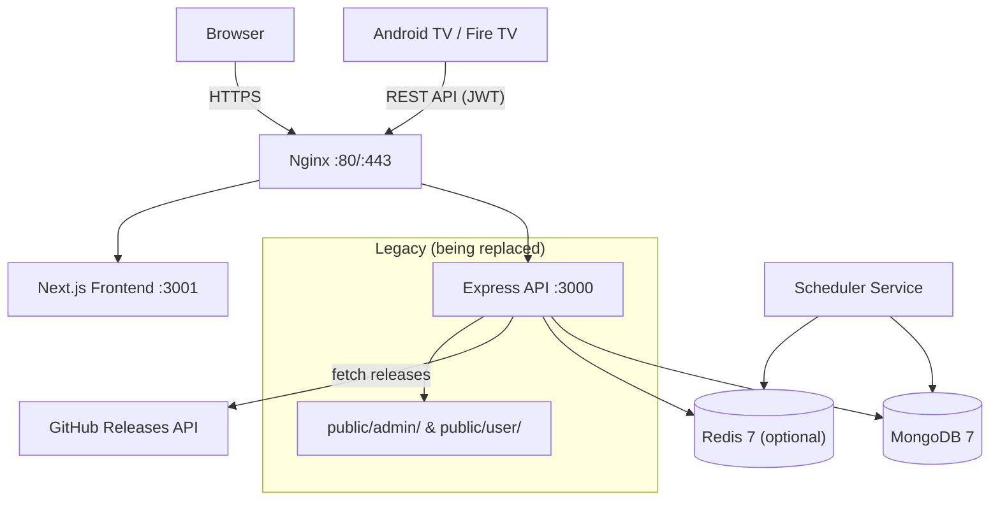
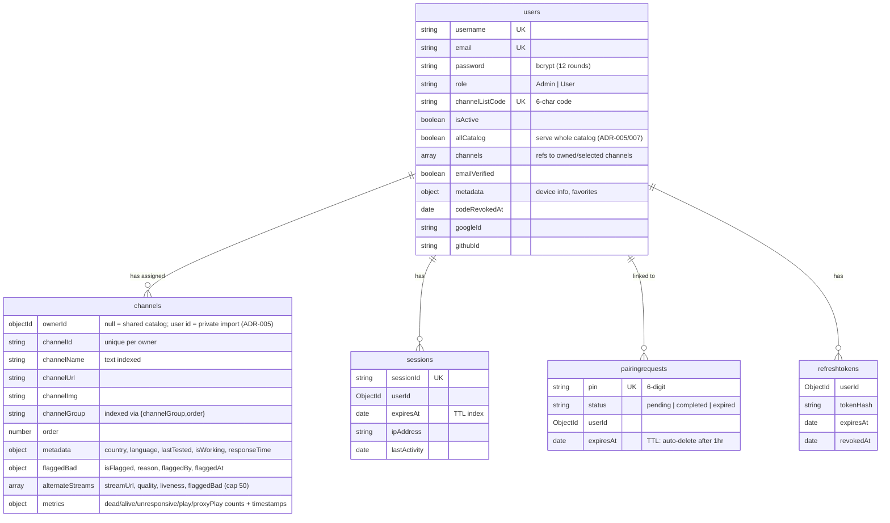
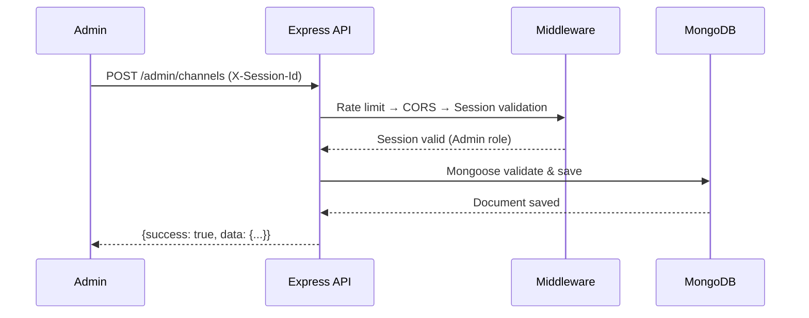
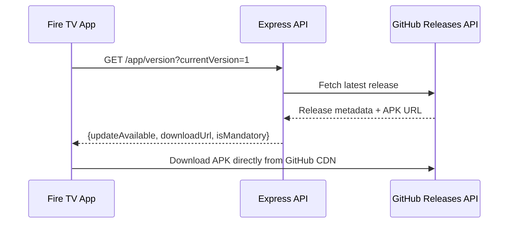
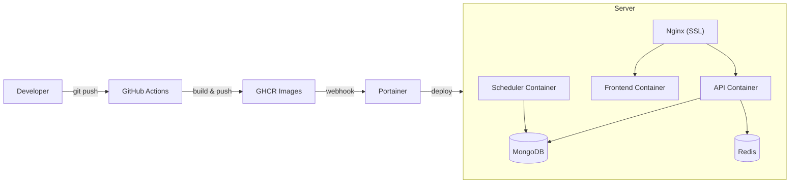

# Architecture

Monorepo: Express API backend + Next.js frontend + shared packages. Serves an Android TV/Fire TV app with channel management, TV pairing, and OTA updates via GitHub Releases.

## System Overview



## Project Structure

```
FireVisionIPTVServer/
├── backend/                 Express API (JavaScript routes/server + TypeScript models/services)
│   └── src/
│       ├── server.js            Express app entry point
│       ├── scheduler-entrypoint.ts  Standalone scheduler process
│       ├── models/              Mongoose models (12 files / 14 collections)
│       ├── routes/              API routes (21 route files)
│       ├── middleware/          Auth & validation
│       ├── services/            Scheduler, EPG, cache/Redis, stream health, external-source caches, import helpers
│       └── utils/               JWT, init scripts
├── frontend/                Next.js 14 App Router
│   └── src/
│       ├── app/                 Pages & layouts
│       ├── components/          UI & layout components
│       ├── lib/                 API client, utilities
│       ├── store/               Zustand state
│       └── hooks/               Custom hooks
├── packages/shared/         Shared TypeScript types & Zod schemas
├── public/                  Legacy dashboards (jQuery/AdminLTE)
├── e2e/                     Playwright E2E tests
├── .github/workflows/       CI/CD pipelines
├── docker-compose.yml              Dev environment
├── docker-compose.production.yml   Production
└── Makefile                 Docker & dev shortcuts
```

## Tech Stack

| Layer       | Technology                                                                                         |
| ----------- | -------------------------------------------------------------------------------------------------- |
| Backend     | Node.js 18, Express.js 4 (routes/server in JS, models/services/middleware in TS)                   |
| Database    | MongoDB 7 (Mongoose 8)                                                                             |
| Cache       | Redis 7 via ioredis (optional, graceful fallback; prod service `firevision-redis` via `REDIS_URL`) |
| Auth        | Session (X-Session-Id) + JWT (Bearer, ioredis-backed refresh tokens) + OAuth2 (Google, GitHub)     |
| Bot defense | Google reCAPTCHA v3 on `/auth/register` (when configured)                                          |
| Frontend    | Next.js 14, Tailwind CSS, Shadcn/ui, TanStack Query, Zustand                                       |
| CI/CD       | GitHub Actions → GHCR → Portainer                                                                  |
| Testing     | Jest, Supertest, Playwright                                                                        |
| Domain      | tv.cadnative.com (Let's Encrypt SSL)                                                               |

## Database Schema

### Collections



Also:

- `auditlogs` — action, resource, resourceId, userId, changes (before/after), ipAddress, status. **TTL: 180 days.**
- `scheduledtaskruns` — per-task run tracking with a partial-unique lock (`{ taskName }` where `status: running`) for distributed single-flight; **TTL: 30 days.**
- `epgprograms` — program guide entries; unique on `{ channelEpgId, startTime }`, **TTL: 24h after `endTime`.**
- `iptvorgcachemetas` / `iptvorgchannels` — IPTV-org enriched channel/stream cache (one doc per stream) with per-stream liveness.
- `externalsourcecachemetas` / `externalsourcechannels` — cache for Pluto TV, Samsung TV Plus, YouTube Live, Prasar Bharati (one meta doc per source+region).
- `seedchannels` — YouTube Live / Prasar Bharati seed definitions resolved to fresh HLS URLs by the scheduler.
- `refreshtokens` — hashed JWT refresh tokens, **TTL on expiry.**
- `appversions` — legacy model retained; live version data is served from the GitHub Releases API, not this collection.

**DB growth is bounded** by TTL indexes (audit logs, task runs, EPG, refresh tokens, sessions, pairing requests), an EPG "skip programs older than 24h" filter aligned to the TTL, and lean/compound indexes chosen to avoid redundant single-field indexes. See ADR-006.

## Data Flows

### Channel Management (Admin)



### App Update Check (Android)



### TV Pairing (PIN-based)

See [TV_PAIRING_SYSTEM.md](./workflow/TV_PAIRING_SYSTEM.md) for full flow.

## Subsystems

### Channel Ownership (ADR-005)

Channels carry an `ownerId`: `null` means the **shared admin catalog** (browsable, servable to the demo code); a user id means a **private import** from that user's M3U/external-source import, never shown to admins. `channelId` is unique **per owner** via a compound index, so different users can privately import the same channel. Access-control queries scope to `ownerId: null` for admins/`allCatalog` users and to the user's own `channels[]` (plus their private imports) for regular users.

### Route-Level Channel Cap (ADR-007)

A user's `channels[]` is capped at `USER_CHANNELS_MAX` (default 5000). The cap is enforced at the **route level on every add path** (`/user-playlist/me/channels/add`, `import-m3u`, external-source `import-user`), not by a schema validator (a validator would brick over-limit legacy users on any save). A best-effort pre-check is paired with an **atomic write-time filter** (`withChannelCapFilter`) so concurrent imports can't overshoot. "Wants everything" users get `allCatalog: true` instead of a giant `channels[]`, serving the whole catalog capped at `TV_CHANNELS_MAX` (default 2000).

### Import Pipeline (categorize / club / dedup)

On M3U import (admin catalog and per-user), channels are: EXTINF titles parsed safely (commas inside `tvg-logo`/user-agent attribute values no longer corrupt names, with repair for previously-leaked names); clubbed by real `tvg-id` into one channel + `alternateStreams` (cap 50; synthetic ids never clubbed); deduplicated against the target set by URL; and auto-categorized (uncategorized channels resolved against the IPTV-org cache by id/name, then by pattern rules — VOD/genre/country-prefix).

### Stream Metrics, Health & Auto-Promotion

Each channel tracks `metrics` (dead/alive/unresponsive/play/proxyPlay counters + last-\* timestamps) and a `flaggedBad` flag (plus per-alternate flags). TV clients report via `report-status`, `report-play`, and bulk `health-sync` (all rate-limited in-memory per device). The scheduler's **Stream Health Check** task probes primaries with alternates and **auto-promotes** the best alive, non-flagged alternate when the primary is dead/flagged (demoting the old primary); it busts the catalog cache on promotion. Admin `stats/stream-health` aggregates these signals (most-failing, most-popular, removal candidates).

### Redis Caching Layer

`ioredis` singleton (`REDIS_URL`, prod service `firevision-redis`), lazy-connect with capped-backoff retry; **all cache ops are no-ops when Redis is absent** so the app runs without it. Domain-scoped `CacheService` instances (`fv:ch:`, `fv:user:`, `fv:stats:`, `fv:release:`, `fv:epg:`) hold the slimmed channel catalog (list/grouped/m3u), user data, stats, GitHub release metadata, and EPG. Catalog payloads are slimmed (field projection) and capped; any catalog mutation busts `catalog:*` / count caches.

### Scheduler Process

`scheduler-entrypoint.ts` runs as a **separate process/container** (own Mongo connection pool, optional Redis). `scheduler-service` registers interval timers and uses an **atomic distributed lock** (`scheduledtaskruns` partial-unique index on `{ taskName }` where `status: running`, with a 5-min TTL, heartbeat refresh, and stale-run recovery on start) so only one instance runs a task at a time. Registered tasks (intervals via env vars):

| Task                   | Default interval | Env var                           | Purpose                                                                     |
| ---------------------- | ---------------- | --------------------------------- | --------------------------------------------------------------------------- |
| Liveness check         | 24h              | `LIVENESS_CHECK_INTERVAL_MS`      | Probe cached IPTV-org + external-source streams; optional dead-stream prune |
| EPG refresh            | 6h               | `EPG_REFRESH_INTERVAL_MS`         | Fetch/update program guide                                                  |
| IPTV-org cache refresh | 1h               | `CACHE_REFRESH_INTERVAL_MS`       | Refresh channel/stream cache from upstream                                  |
| Stream health check    | 4h               | `STREAM_HEALTH_CHECK_INTERVAL_MS` | Probe primaries with alternates, auto-promote alive alternates              |
| YouTube URL refresh    | 4h               | `YOUTUBE_REFRESH_INTERVAL_MS`     | Resolve fresh HLS URLs for YouTube Live / Prasar Bharati seeds              |

On an uncaught exception the process **exits for a clean container restart** (in-memory locks/timers may be invalid); a stray rejected promise only logs. Admins drive it via the `/api/v1/scheduler` routes. `DISABLE_SCHEDULER` skips it in the API process.

## Security

| Layer       | Measures                                                                                                                                                                                                                |
| ----------- | ----------------------------------------------------------------------------------------------------------------------------------------------------------------------------------------------------------------------- |
| Network     | Firewall (UFW), ports 80/443 only                                                                                                                                                                                       |
| Transport   | TLS 1.2/1.3 (Let's Encrypt), HTTPS enforced                                                                                                                                                                             |
| Application | Session + JWT auth, per-user rate limiting (1000/15min API, 20/15min auth; admin sessions exempt), reCAPTCHA v3 on registration, CORS, Helmet.js, CSRF protection, SSRF protection in proxy/import routes (DNS pinning) |
| Data        | bcrypt password hashing (12 rounds), Mongoose schema validation, no direct external DB access                                                                                                                           |

## Deployment



- **Dev:** `npm run dev` or `make up` — runs API (:3000), Frontend (:3001), MongoDB, Redis, MailHog
- **Prod:** Docker Compose with Nginx SSL termination
