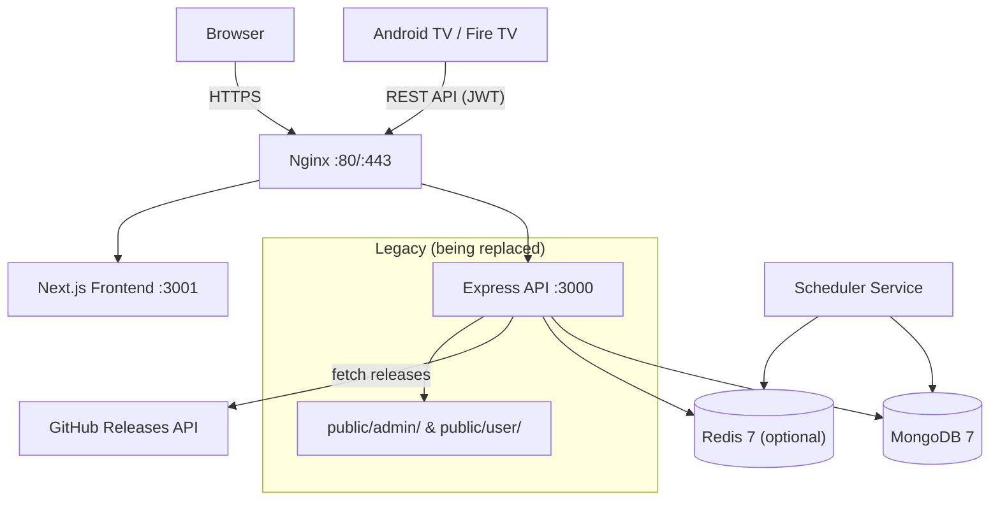
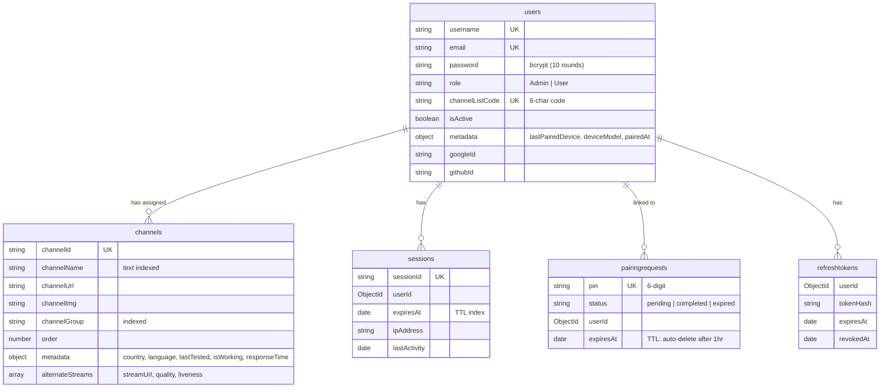
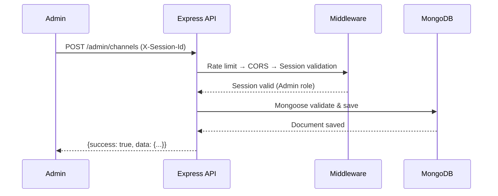
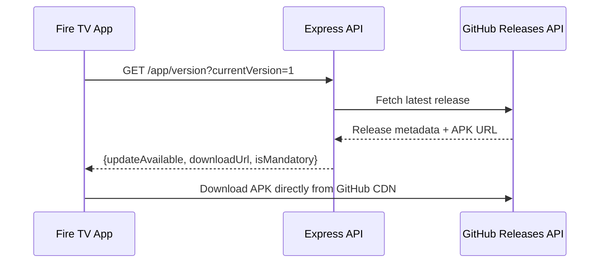
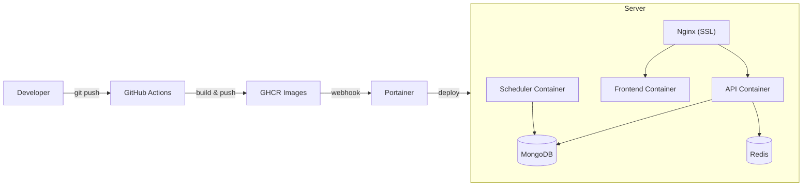

# Architecture

Monorepo: Express API backend + Next.js frontend + shared packages. Serves an Android TV/Fire TV app with channel management, TV pairing, and OTA updates via GitHub Releases.

## System Overview



## Project Structure

```
FireVisionIPTVServer/
├── backend/                 Express API (TypeScript)
│   └── src/
│       ├── models/              Mongoose models (7 models)
│       ├── routes/              API routes (15 route files)
│       ├── middleware/          Auth & validation
│       ├── services/            Scheduler, EPG, cache, email, stream prober
│       └── utils/               JWT, init scripts
├── frontend/                Next.js 14 App Router
│   └── src/
│       ├── app/                 Pages & layouts
│       ├── components/          UI & layout components
│       ├── lib/                 API client, utilities
│       ├── store/               Zustand state
│       └── hooks/               Custom hooks
├── packages/shared/         Shared TypeScript types & Zod schemas
├── public/                  Legacy dashboards (jQuery/AdminLTE)
├── e2e/                     Playwright E2E tests
├── .github/workflows/       CI/CD pipelines
├── docker-compose.yml              Dev environment
├── docker-compose.production.yml   Production
└── Makefile                 Docker & dev shortcuts
```

## Tech Stack

| Layer    | Technology                                                      |
| -------- | --------------------------------------------------------------- |
| Backend  | Node.js 18, Express.js 4, TypeScript                            |
| Database | MongoDB 7 (Mongoose 8)                                          |
| Cache    | Redis 7 (optional, graceful fallback)                           |
| Auth     | Session (X-Session-Id) + JWT (Bearer) + OAuth2 (Google, GitHub) |
| Frontend | Next.js 14, Tailwind CSS, Shadcn/ui, TanStack Query, Zustand    |
| CI/CD    | GitHub Actions → GHCR → Portainer                               |
| Testing  | Jest, Supertest, Playwright                                     |
| Domain   | tv.cadnative.com (Let's Encrypt SSL)                            |

## Database Schema

### Collections



Also: `appversions` (managed via GitHub Releases API), `auditlogs` (action, userId, targetId, details, ipAddress).

## Data Flows

### Channel Management (Admin)



### App Update Check (Android)



### TV Pairing (PIN-based)

See [TV_PAIRING_SYSTEM.md](./TV_PAIRING_SYSTEM.md) for full flow.

## Security

| Layer       | Measures                                                                                                            |
| ----------- | ------------------------------------------------------------------------------------------------------------------- |
| Network     | Firewall (UFW), ports 80/443 only                                                                                   |
| Transport   | TLS 1.2/1.3 (Let's Encrypt), HTTPS enforced                                                                         |
| Application | Session + JWT auth, rate limiting (1000/15min API, 20/15min auth), CORS, Helmet.js, SSRF protection in proxy routes |
| Data        | bcrypt password hashing (10 rounds), Mongoose schema validation, no direct external DB access                       |

## Deployment



- **Dev:** `npm run dev` or `make up` — runs API (:3000), Frontend (:3001), MongoDB, Redis, MailHog
- **Prod:** Docker Compose with Nginx SSL termination
