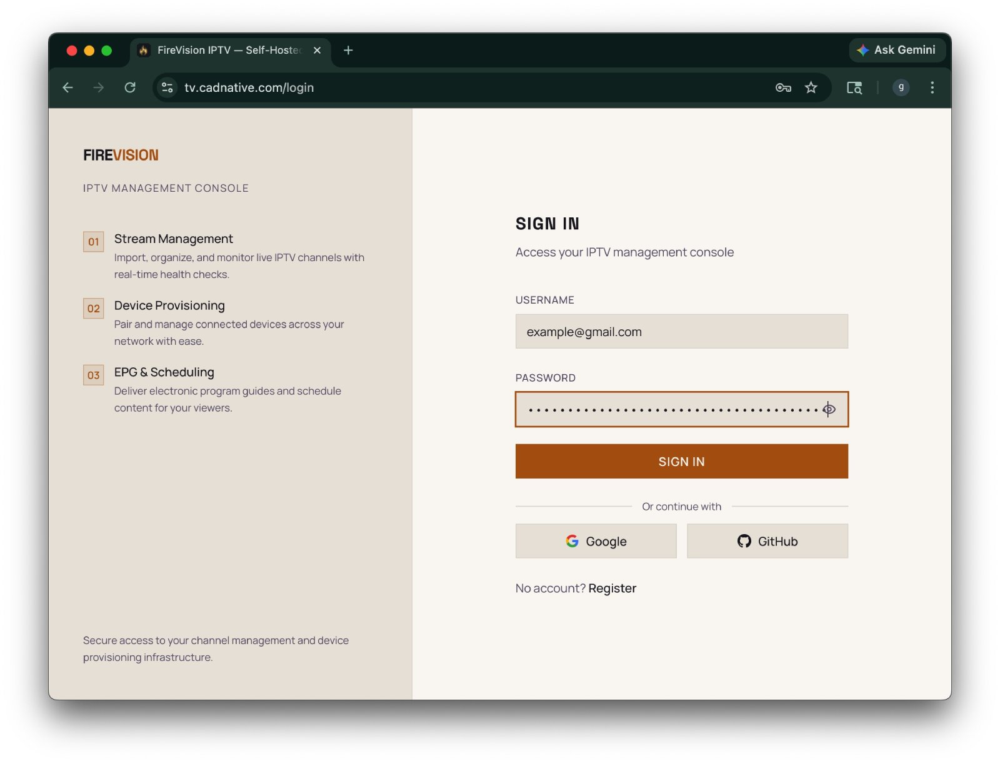
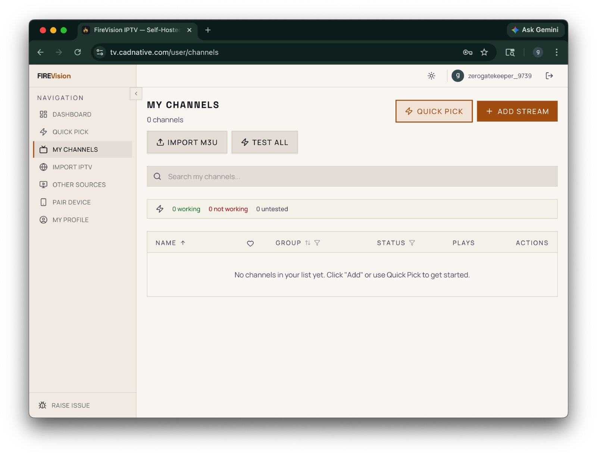
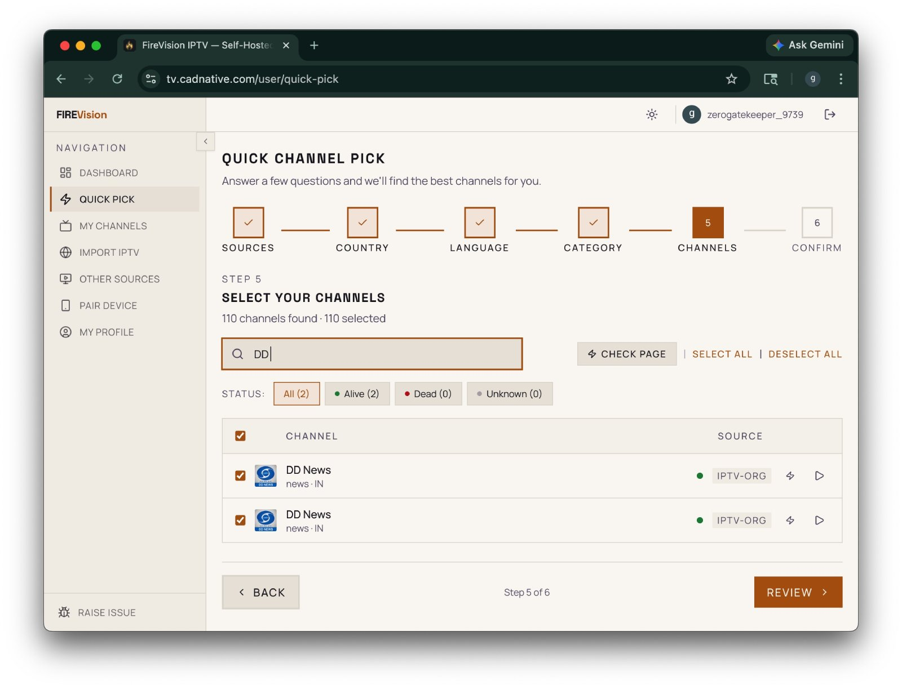

# How to Add Channels to Your Playlist

After pairing your TV device, you need to add channels to your personal playlist before they'll appear on your TV.

---

## Steps

### 1. Log in to the Web Dashboard

Open your browser and go to your FireVision server URL (e.g. `https://tv.cadnative.com/login`).
Log in with the same account you used to pair your TV — [Go to Login](https://tv.cadnative.com/login).

### 2. Navigate to "My Channels"

From the sidebar, click **Channels** to open the channel browser — [Go to My Channels](https://tv.cadnative.com/user/channels).

Here you can see all available channels from your connected sources.

### 3. Use Quick Pick for Bulk Adding

If you want to add popular channels fast, use **Quick Pick** — [Go to Quick Pick](https://tv.cadnative.com/user/quick-pick).

Quick Pick lets you select from curated groups and add many channels at once.

### 4. Refresh on Your TV

Go back to your TV app:

- Wait a few seconds — the app refreshes automatically when you return to it
- Or select **Refresh** on the empty screen to reload immediately

Your channels should now appear on the Home and Channels screens.

---

## Quick Links

| Action          | Link                                                                                 |
| --------------- | ------------------------------------------------------------------------------------ |
| Login           | [https://tv.cadnative.com/login](https://tv.cadnative.com/login)                     |
| My Channels     | [https://tv.cadnative.com/user/channels](https://tv.cadnative.com/user/channels)     |
| Quick Pick      | [https://tv.cadnative.com/user/quick-pick](https://tv.cadnative.com/user/quick-pick) |
| My Sources      | [https://tv.cadnative.com/user/sources](https://tv.cadnative.com/user/sources)       |
| Import Channels | [https://tv.cadnative.com/user/import](https://tv.cadnative.com/user/import)         |
| My Devices      | [https://tv.cadnative.com/user/devices](https://tv.cadnative.com/user/devices)       |

> **Note:** Replace `localhost:3001` with your actual server URL if you're running remotely.

---

## Tips

- You can **remove channels** from your playlist at any time from the [My Channels](https://tv.cadnative.com/user/channels) page
- Channels are grouped by category — use the category filter to narrow results
- Your playlist is personal — other users on the same server have their own playlists
- Need more sources? Add them from [My Sources](https://tv.cadnative.com/user/sources) or [Import](https://tv.cadnative.com/user/import)
