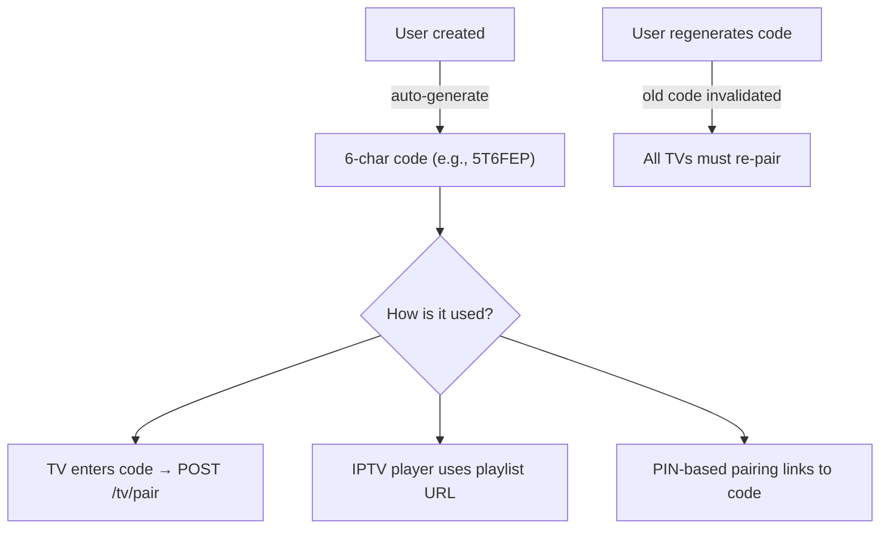

# Channel List Code System

Each user gets a unique 6-character code that links their TV device to their channel list.

## How It Works



### Code Generation

- Format: 6 uppercase alphanumeric characters (A-Z, 0-9)
- Generated via: `crypto.randomBytes(3).toString('hex').toUpperCase()`
- Unique per user (enforced by MongoDB unique index)

### Super Admin

- On first startup, super admin is created with code from `SUPER_ADMIN_CHANNEL_LIST_CODE` env var (default: `5T6FEP`)
- If not set, a random code is generated and logged to console

### New Users

- Every new registration auto-generates a unique code
- Visible in user profile page
- Can be regenerated (invalidates old code, all TVs must re-pair)

## API Endpoints

| Endpoint                                        | Auth    | Description           |
| ----------------------------------------------- | ------- | --------------------- |
| `GET /tv/playlist/:code`                        | None    | M3U playlist by code  |
| `GET /tv/playlist/:code/json`                   | None    | JSON playlist by code |
| `GET /user-playlist/by-code/:code/channels`     | None    | Channel list by code  |
| `GET /user-playlist/by-code/:code/playlist.m3u` | None    | M3U by code           |
| `PUT /users/:id/regenerate-code`                | Session | Regenerate code       |

### Legacy

`GET /channels/playlist.m3u?code=<code>` — falls back to `PLAYLIST_CODE` or `SUPER_ADMIN_CHANNEL_LIST_CODE` env var.

## Playlist URL Format

```
http://<SERVER_IP>:3000/api/v1/tv/playlist/<YOUR_CODE>
```

## Environment Variables

| Variable                        | Default  | Description                                   |
| ------------------------------- | -------- | --------------------------------------------- |
| `SUPER_ADMIN_CHANNEL_LIST_CODE` | `5T6FEP` | Admin's code. Auto-generated if unset.        |
| `PLAYLIST_CODE`                 | —        | Legacy global code. Falls back to admin code. |

## Troubleshooting

| Problem                  | Fix                                                                              |
| ------------------------ | -------------------------------------------------------------------------------- |
| Code not working         | Verify: `db.users.findOne({channelListCode: '<code>'})` — check `isActive: true` |
| Super admin code not set | Check `.env` has `SUPER_ADMIN_CHANNEL_LIST_CODE`, restart server, check logs     |
| Code conflict            | System auto-generates unique codes. Regenerate if needed.                        |
