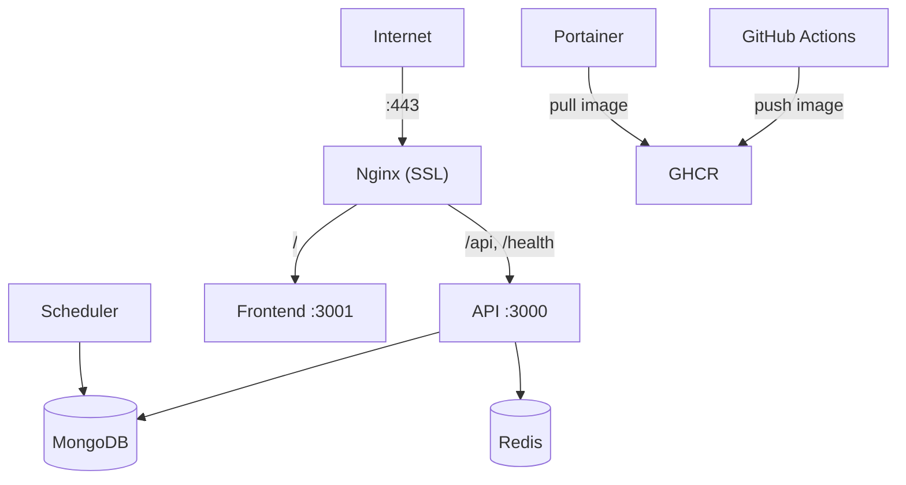

# Production Deployment Guide

Deploy FireVision IPTV Server to a Linux cloud server with SSL and auto-restart.

## Architecture



## Server Requirements

| Spec    | Minimum                 |
| ------- | ----------------------- |
| OS      | Ubuntu 22.04 LTS        |
| RAM     | 2 GB (4 GB recommended) |
| Storage | 20 GB                   |
| CPU     | 2 vCPUs                 |

Prerequisites: Docker, Docker Compose, a domain pointing to the server.

## Setup

### 1. Upload files

```bash
# Clone to /opt
cd /opt
sudo mkdir firevision-iptv && sudo chown $USER:$USER firevision-iptv
git clone <repo-url> firevision-iptv
cd firevision-iptv/FireVisionIPTVServer
```

### 2. Domain DNS

Add an A record pointing your subdomain to the server IP:

```
Type: A    Host: tv    Value: <SERVER_IP>    TTL: 3600
```

Verify: `dig tv.cadnative.com`

### 3. SSL certificates

```bash
sudo certbot certonly --standalone -d tv.cadnative.com
mkdir -p nginx/ssl
sudo cp /etc/letsencrypt/live/tv.cadnative.com/fullchain.pem nginx/ssl/
sudo cp /etc/letsencrypt/live/tv.cadnative.com/privkey.pem nginx/ssl/
sudo chown -R $USER:$USER nginx/ssl
```

### 4. Nginx config

Uncomment the SSL block in `nginx/nginx.conf`:

```nginx
server {
    listen 80;
    server_name tv.cadnative.com;
    return 301 https://$server_name$request_uri;
}

server {
    listen 443 ssl http2;
    server_name tv.cadnative.com;
    ssl_certificate /etc/nginx/ssl/fullchain.pem;
    ssl_certificate_key /etc/nginx/ssl/privkey.pem;
    ssl_protocols TLSv1.2 TLSv1.3;
    ssl_ciphers HIGH:!aNULL:!MD5;
    ssl_prefer_server_ciphers on;
    # ... rest of config
}
```

### 5. Environment config

```bash
cp .env.example .env
```

Key production values:

```env
NODE_ENV=production
MONGODB_URI=mongodb://mongodb:27017/firevision-iptv
JWT_ACCESS_SECRET=<generate-with-openssl-rand-hex-32>
JWT_REFRESH_SECRET=<generate-with-openssl-rand-hex-32>
SUPER_ADMIN_PASSWORD=YourSecurePassword123!
ALLOWED_ORIGINS=https://tv.cadnative.com
GH_APP_OWNER=akshaynikhare
GH_APP_REPO=FireVisionIPTV
```

### 6. Start services

```bash
docker-compose up -d
docker-compose ps        # verify all containers are Up
```

### 7. Verify

```bash
curl https://tv.cadnative.com/health
# {"status":"ok","timestamp":"...","uptime":...,"mongodb":"connected"}

curl https://tv.cadnative.com/api/v1/channels
# {"success":true,"count":0,"data":[]}
```

## Auto-restart (systemd)

```ini
# /etc/systemd/system/firevision-iptv.service
[Unit]
Description=FireVision IPTV Server
Requires=docker.service
After=docker.service

[Service]
Type=oneshot
RemainAfterExit=yes
WorkingDirectory=/opt/firevision-iptv/FireVisionIPTVServer
ExecStart=/usr/local/bin/docker-compose up -d
ExecStop=/usr/local/bin/docker-compose down
TimeoutStartSec=0
User=firevision
Group=firevision

[Install]
WantedBy=multi-user.target
```

```bash
sudo systemctl daemon-reload
sudo systemctl enable firevision-iptv
sudo systemctl start firevision-iptv
```

## SSL auto-renewal

```bash
# Add to root crontab (sudo crontab -e):
0 3 * * * certbot renew --quiet --deploy-hook "cd /opt/firevision-iptv/FireVisionIPTVServer && cp /etc/letsencrypt/live/tv.cadnative.com/*.pem nginx/ssl/ && docker-compose restart nginx"
```

## Initial Channel Setup

### Import M3U playlist

```bash
curl -X POST https://tv.cadnative.com/api/v1/admin/channels/import-m3u \
  -H "Content-Type: application/json" \
  -H "X-Session-Id: <SESSION_ID>" \
  -d "{\"m3uContent\": $(jq -Rs . /path/to/playlist.m3u), \"clearExisting\": false}"
```

### Add channel manually

```bash
curl -X POST https://tv.cadnative.com/api/v1/admin/channels \
  -H "Content-Type: application/json" \
  -H "X-Session-Id: <SESSION_ID>" \
  -d '{
    "channelId": "cnn_news",
    "channelName": "CNN International",
    "channelUrl": "https://cnn-cnninternational-1-eu.rakuten.wurl.tv/playlist.m3u8",
    "channelImg": "https://upload.wikimedia.org/wikipedia/commons/thumb/b/b1/CNN.svg/200px-CNN.svg.png",
    "channelGroup": "News",
    "isActive": true
  }'
```

### Verify

```bash
curl https://tv.cadnative.com/api/v1/channels | jq '.count'
```

## Backup

```bash
#!/bin/bash
# /home/firevision/backup-firevision.sh
BACKUP_DIR="/home/firevision/backups"
DATE=$(date +%Y%m%d-%H%M%S)
mkdir -p $BACKUP_DIR

# MongoDB dump
docker-compose -f /opt/firevision-iptv/FireVisionIPTVServer/docker-compose.yml \
    exec -T mongodb mongodump --db=firevision-iptv --archive > $BACKUP_DIR/mongodb-$DATE.archive

# Keep 7 days
find $BACKUP_DIR -type f -mtime +7 -delete
```

Schedule: `0 2 * * * /home/firevision/backup-firevision.sh >> /home/firevision/backup.log 2>&1`

## App Updates

APK updates are served via GitHub Releases. Publish a release with an APK asset on the `FireVisionIPTV` repo — the server auto-serves it via `GET /api/v1/app/version`.

## Troubleshooting

| Problem               | Commands                                                                           |
| --------------------- | ---------------------------------------------------------------------------------- |
| Server not responding | `docker-compose ps` then `docker-compose restart`                                  |
| MongoDB issues        | `docker-compose exec mongodb mongosh --eval "db.adminCommand('ping')"`             |
| APK download failing  | Verify `GH_APP_OWNER` / `GH_APP_REPO` env vars, check GitHub release has APK asset |
| View logs             | `docker-compose logs -f api`                                                       |

## Pre-Launch Checklist

- [ ] SSL working on `https://tv.cadnative.com`
- [ ] `/health` returns `{"status":"ok"}`
- [ ] Channels imported and visible
- [ ] Systemd auto-restart enabled
- [ ] SSL auto-renewal cron configured
- [ ] Backups scheduled
- [ ] GitHub Release has APK asset
- [ ] `ALLOWED_ORIGINS` set to production domain
