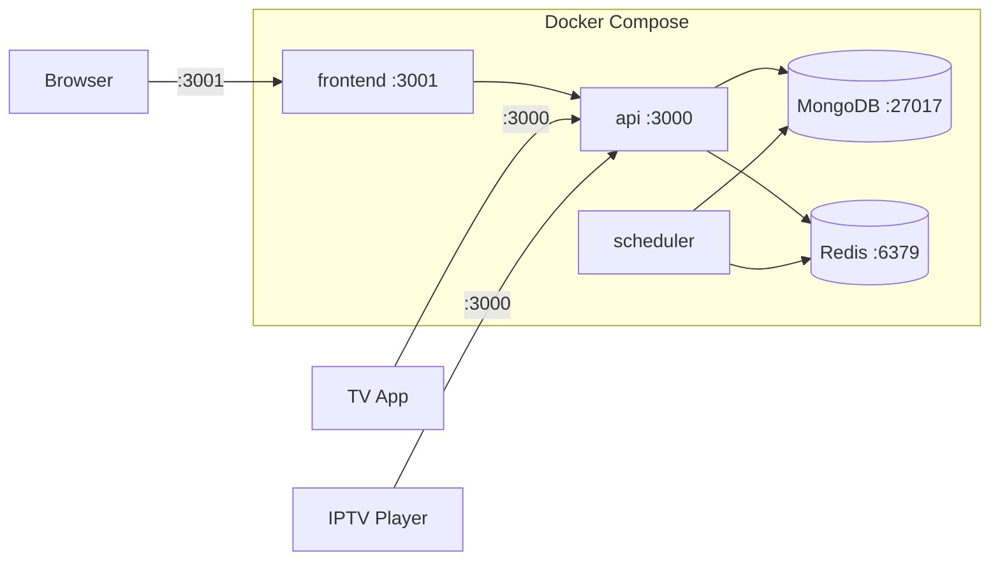

# Self-Hosting Guide

Set up your own FireVision IPTV server using Docker Compose.

## Architecture



## Prerequisites

| Requirement             | Details                                               |
| ----------------------- | ----------------------------------------------------- |
| Docker & Docker Compose | [Install Docker](https://docs.docker.com/get-docker/) |
| RAM                     | 2 GB minimum                                          |
| Network                 | Server must stay powered on and connected             |

## Setup

### 1. Get the files

**Option A — Download two files:**

Download `docker-compose.selfhost.yml` and `.env.example` from the [GitHub repository](https://github.com/akshaynikhare/FireVisionIPTVServer), then rename `.env.example` to `.env`.

**Option B — Clone:**

```bash
git clone https://github.com/akshaynikhare/FireVisionIPTVServer.git
cd FireVisionIPTVServer
cp .env.example .env
```

### 2. Configure `.env`

Open `.env` and set the required values:

```env
# Admin account (change these)
SUPER_ADMIN_USERNAME=myadmin
SUPER_ADMIN_PASSWORD=MySecurePassword123!
SUPER_ADMIN_EMAIL=you@example.com

# Security — generate with: node -e "console.log(require('crypto').randomBytes(32).toString('hex'))"
JWT_ACCESS_SECRET=<random-32-char-string>
JWT_REFRESH_SECRET=<different-random-32-char-string>

# Docker images
DOCKER_IMAGE=ghcr.io/akshaynikhare/firevisioniptvserver:latest
DOCKER_FRONTEND_IMAGE=ghcr.io/akshaynikhare/firevisioniptvserver-frontend:latest
```

### 3. Start the server

```bash
docker compose -f docker-compose.selfhost.yml up -d
```

Verify all containers are running:

```bash
docker compose -f docker-compose.selfhost.yml ps
```

Expected output — all containers should show `Up`:

```
firevision-api         Up
firevision-frontend    Up
firevision-mongodb     Up
firevision-redis       Up
firevision-scheduler   Up
```

### 4. First login

Open `http://localhost:3001` and log in with your `SUPER_ADMIN_USERNAME` / `SUPER_ADMIN_PASSWORD`.

### 5. Add channels

- **Bulk import:** Channels section → Import → paste M3U playlist content or upload file
- **Manual:** Channels section → Add Channel → fill name, stream URL (`.m3u8`), logo URL, group

### 6. Get your playlist code

Every user gets a unique 6-character code (e.g., `5T6FEP`). Find it in your user profile or Users section.

**Playlist URL format:**

```
http://<SERVER_IP>:3000/api/v1/tv/playlist/<YOUR_CODE>
```

## Connecting Devices

### FireVision TV App

1. Install the app on Fire TV / Android TV
2. App displays a pairing PIN
3. Enter the PIN in the web dashboard's TV pairing section
4. Channels load automatically

### Any IPTV Player (VLC, TiviMate, etc.)

Use your playlist URL:

```
http://<SERVER_IP>:3000/api/v1/tv/playlist/<YOUR_CODE>
```

### Remote Access

| Method                      | When to use                                                 |
| --------------------------- | ----------------------------------------------------------- |
| Port forwarding (port 3000) | Simple remote access — set `ALLOWED_ORIGINS` to your domain |
| Tailscale / VPN             | Secure access without port forwarding                       |
| Reverse proxy (Nginx/Caddy) | Custom domain + SSL                                         |

---

## Configuration Reference

### Core

| Variable      | Default      | Required | Description                          |
| ------------- | ------------ | -------- | ------------------------------------ |
| `PORT`        | `3000`       | No       | API port inside Docker               |
| `NODE_ENV`    | `production` | No       | Set to `production` for self-hosting |
| `APP_VERSION` | `0.0.0`      | No       | Application version string           |

### Database & Cache

| Variable      | Default                                   | Required | Description                                                                          |
| ------------- | ----------------------------------------- | -------- | ------------------------------------------------------------------------------------ |
| `MONGODB_URI` | `mongodb://mongodb:27017/firevision-iptv` | No       | MongoDB connection. Default works with Docker Compose.                               |
| `REDIS_URL`   | `redis://redis:6379`                      | No       | Redis connection. App works without Redis. Docker Compose overrides this internally. |

### Admin Account

| Variable                        | Default                | Required | Description                                                      |
| ------------------------------- | ---------------------- | -------- | ---------------------------------------------------------------- |
| `SUPER_ADMIN_USERNAME`          | `admin`                | **Yes**  | Initial admin username                                           |
| `SUPER_ADMIN_PASSWORD`          | `admin123`             | **Yes**  | Initial admin password                                           |
| `SUPER_ADMIN_EMAIL`             | `admin@yourdomain.com` | **Yes**  | Admin email                                                      |
| `SUPER_ADMIN_CHANNEL_LIST_CODE` | `5T6FEP`               | No       | Admin playlist code. Auto-generated if unset.                    |
| `FORCE_UPDATE_ADMIN_PASSWORD`   | `false`                | No       | Set `true` to reset admin password on restart. Remove after use. |

### Security

| Variable             | Default | Required | Description                              |
| -------------------- | ------- | -------- | ---------------------------------------- |
| `JWT_ACCESS_SECRET`  | —       | **Yes**  | Random string for signing login tokens   |
| `JWT_REFRESH_SECRET` | —       | **Yes**  | Random string for signing refresh tokens |
| `ALLOWED_ORIGINS`    | `*`     | No       | Comma-separated allowed web origins      |

### OAuth (Optional)

| Variable                                                                  | Description                                         |
| ------------------------------------------------------------------------- | --------------------------------------------------- |
| `GOOGLE_CLIENT_ID` / `GOOGLE_CLIENT_SECRET` / `GOOGLE_REDIRECT_URI`       | Google OAuth. See [OAUTH_SETUP.md](OAUTH_SETUP.md). |
| `GH_OAUTH_CLIENT_ID` / `GH_OAUTH_CLIENT_SECRET` / `GH_OAUTH_REDIRECT_URI` | GitHub OAuth. See [OAUTH_SETUP.md](OAUTH_SETUP.md). |

### Email (Optional)

| Variable                        | Default                    | Description                         |
| ------------------------------- | -------------------------- | ----------------------------------- |
| `MAIL_PROVIDER`                 | `mailhog`                  | Use `brevo` for real email delivery |
| `BREVO_HOST`                    | `smtp-relay.brevo.com`     | SMTP hostname                       |
| `BREVO_PORT`                    | `587`                      | SMTP port                           |
| `BREVO_USER` / `BREVO_PASSWORD` | —                          | SMTP credentials                    |
| `MAIL_FROM`                     | `noreply@firevision.local` | Sender address                      |
| `APP_URL`                       | `http://localhost:3001`    | Frontend URL (used in email links)  |

### Scheduler

| Variable                          | Default                | Description                                               |
| --------------------------------- | ---------------------- | --------------------------------------------------------- |
| `DISABLE_SCHEDULER`               | `true` (API container) | Set `true` on API when scheduler runs as separate service |
| `LIVENESS_CHECK_INTERVAL_MS`      | `86400000` (24h)       | Channel liveness check interval                           |
| `EPG_REFRESH_INTERVAL_MS`         | `21600000` (6h)        | TV guide refresh interval                                 |
| `CACHE_REFRESH_INTERVAL_MS`       | `3600000` (1h)         | External source cache refresh                             |
| `STREAM_HEALTH_CHECK_INTERVAL_MS` | `14400000` (4h)        | Stream health + alternate promotion                       |
| `YOUTUBE_REFRESH_INTERVAL_MS`     | `14400000` (4h)        | YouTube live URL refresh                                  |

### App Updates (Optional)

| Variable             | Default          | Description                         |
| -------------------- | ---------------- | ----------------------------------- |
| `GH_APP_OWNER`       | `akshaynikhare`  | GitHub user owning the app repo     |
| `GH_APP_REPO`        | `FireVisionIPTV` | App repository name                 |
| `GH_APP_APK_PATTERN` | `.apk`           | Pattern to match APK in releases    |
| `GH_APP_TOKEN`       | —                | GitHub token for higher rate limits |

### Docker Images

| Variable                | Default                                                      | Required | Description           |
| ----------------------- | ------------------------------------------------------------ | -------- | --------------------- |
| `DOCKER_IMAGE`          | `ghcr.io/akshaynikhare/firevisioniptvserver:latest`          | **Yes**  | API + scheduler image |
| `DOCKER_FRONTEND_IMAGE` | `ghcr.io/akshaynikhare/firevisioniptvserver-frontend:latest` | **Yes**  | Frontend image        |

### Other

| Variable             | Default | Description                     |
| -------------------- | ------- | ------------------------------- |
| `SENTRY_DSN`         | —       | Sentry error tracking DSN       |
| `YT_DLP_CONCURRENCY` | `3`     | Max concurrent yt-dlp processes |

---

## Updating

```bash
docker compose -f docker-compose.selfhost.yml pull
docker compose -f docker-compose.selfhost.yml up -d
```

Data is stored in Docker volumes and persists across updates.

---

## Troubleshooting

### Port 3000 already in use

Logs show `EADDRINUSE`. Another app is using port 3000 — stop it or change the port mapping in the compose file. Dev compose uses port 8009 instead.

### MongoDB connection refused

Logs show `MongoServerSelectionError` or `ECONNREFUSED 127.0.0.1:27017`.

1. Check MongoDB container: `docker compose -f docker-compose.selfhost.yml ps`
2. View its logs: `docker compose -f docker-compose.selfhost.yml logs mongodb`
3. Verify `MONGODB_URI` uses `mongodb://mongodb:27017/` (not `localhost`) with Docker Compose
4. Restart: `docker compose -f docker-compose.selfhost.yml down && docker compose -f docker-compose.selfhost.yml up -d`

### Redis connection issues

Redis is optional. If it keeps failing, remove the `redis` service from compose and remove `REDIS_URL` from `.env`.

### Cannot log in

1. Verify `SUPER_ADMIN_USERNAME` / `SUPER_ADMIN_PASSWORD` in `.env` match what you're typing
2. Admin account is created on first startup. If you changed the password after first run, set `FORCE_UPDATE_ADMIN_PASSWORD=true` and restart the API, then remove it.

### Streams work in browser but not on TV

1. Use the server's LAN IP (e.g., `192.168.1.100`), not `localhost`
2. Ensure TV and server are on the same network
3. Check port 3000 isn't blocked by a firewall

### Disk space

```bash
docker system df          # Check Docker disk usage
docker system prune       # Remove unused images/containers (safe)
```

> Do not use `docker system prune --volumes` — this deletes your database.

### Starting fresh

```bash
docker compose -f docker-compose.selfhost.yml down -v   # Deletes ALL data
docker compose -f docker-compose.selfhost.yml up -d
```

### Viewing logs

```bash
docker compose -f docker-compose.selfhost.yml logs -f api        # API
docker compose -f docker-compose.selfhost.yml logs -f frontend   # Frontend
docker compose -f docker-compose.selfhost.yml logs -f mongodb    # Database
docker compose -f docker-compose.selfhost.yml logs -f            # All
```
