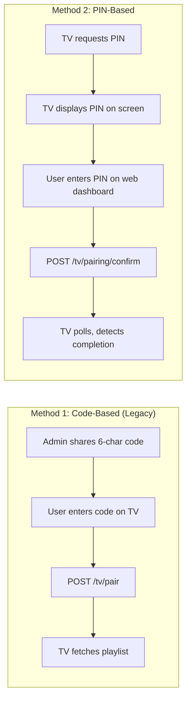
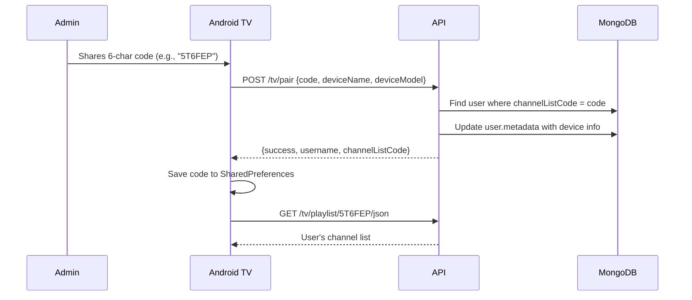
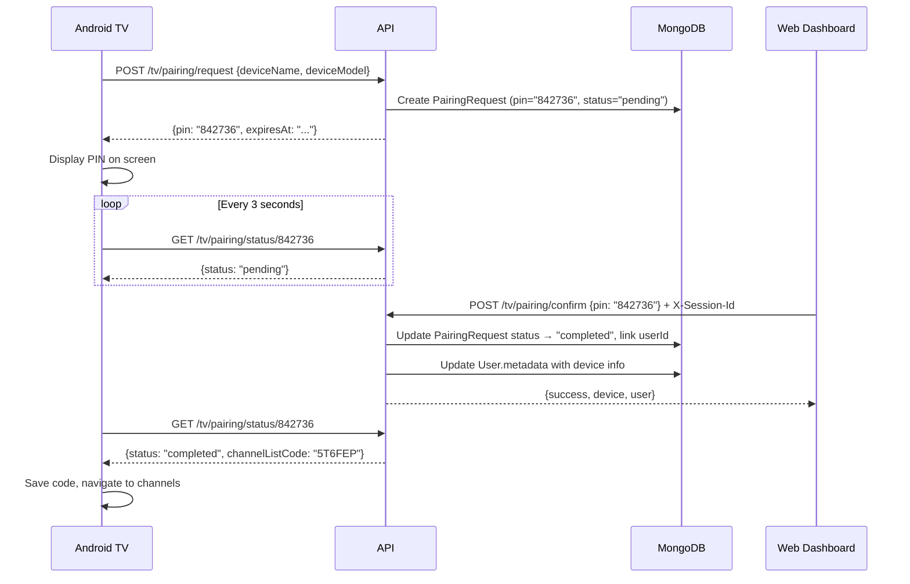

# TV Pairing System

Two methods for pairing Android TV / Fire TV devices.

## Pairing Methods



| Method     | When to use                                          |
| ---------- | ---------------------------------------------------- |
| PIN-based  | New users, non-technical users — more intuitive      |
| Code-based | Multiple TVs (same code works on all), offline setup |

## Data Models

### User (pairing-relevant fields)

```javascript
{
  channelListCode: String,    // 6-char code (e.g., "5T6FEP") — auto-generated
  metadata: {
    lastPairedDevice: String, // e.g., "Samsung Smart TV"
    deviceModel: String,      // e.g., "QN65Q80AAFXZA"
    pairedAt: Date
  }
}
```

### PairingRequest (temporary, PIN-based only)

```javascript
{
  pin: String,              // 6-digit numeric (e.g., "842736")
  deviceName: String,
  deviceModel: String,
  status: "pending" | "completed" | "expired",
  userId: ObjectId,         // null until confirmed
  expiresAt: Date,          // default: now + 10 min
  ipAddress: String,
  userAgent: String
}
```

- Expires after 10 minutes (configurable: `PAIRING_PIN_EXPIRY_MINUTES`)
- TTL index auto-deletes records 1 hour after expiry
- No permanent TV device records exist

## Code-Based Flow



## PIN-Based Flow



## TV Storage Design

TVs are **not** stored as separate documents. Device info lives in `User.metadata` (last paired device only).

| Aspect                 | Behavior                                                       |
| ---------------------- | -------------------------------------------------------------- |
| Multiple TVs, one user | All TVs use the same code. Only last device shown in metadata. |
| Revocation             | Change/regenerate code → all TVs unpaired                      |
| PairingRequest records | Temporary, auto-deleted by TTL index                           |

## API Endpoints

### No Auth Required (TV)

| Method | Endpoint                  | Description                    |
| ------ | ------------------------- | ------------------------------ |
| GET    | `/tv/playlist/:code`      | M3U playlist by code           |
| GET    | `/tv/playlist/:code/json` | JSON playlist by code          |
| POST   | `/tv/pair`                | Pair device with code (legacy) |
| GET    | `/tv/verify/:code`        | Check code validity            |
| POST   | `/tv/pairing/request`     | Generate pairing PIN           |
| GET    | `/tv/pairing/status/:pin` | Poll PIN status                |

### Auth Required (Web Dashboard)

| Method | Endpoint              | Auth    | Description         |
| ------ | --------------------- | ------- | ------------------- |
| POST   | `/tv/pairing/confirm` | Session | Confirm PIN pairing |

## Security

| Measure          | Details                                                             |
| ---------------- | ------------------------------------------------------------------- |
| Code brute-force | 36^6 = 2.2B combinations, rate limited (10 req / 5 min)             |
| PIN expiry       | 10 min default, configurable via `PAIRING_PIN_EXPIRY_MINUTES`       |
| PIN confirmation | Requires valid session (authenticated user)                         |
| Status polling   | Rate limited: 120 req / 10 min                                      |
| IP logging       | PairingRequest stores IP + User-Agent                               |
| No TV auth       | TVs use code as credential — suitable for household, not enterprise |

## Configuration

### Environment Variables

| Variable                     | Default                    | Description              |
| ---------------------------- | -------------------------- | ------------------------ |
| `DEFAULT_TV_CODE`            | `5T6FEP`                   | Default code for testing |
| `DEFAULT_SERVER_URL`         | `https://tv.cadnative.com` | Server URL               |
| `PAIRING_PIN_EXPIRY_MINUTES` | `10`                       | PIN expiry time          |

### Android SharedPreferences

| Key                     | Description              |
| ----------------------- | ------------------------ |
| `server_url`            | Server base URL          |
| `tv_code`               | User's channel list code |
| `autoload_channel_id`   | Auto-play channel ID     |
| `autoload_channel_name` | Auto-play channel name   |

### MongoDB Indexes

```javascript
// User
channelListCode: {
  unique: true;
}

// PairingRequest
pin: {
  unique: true;
}
expiresAt: {
  expireAfterSeconds: 3600;
} // TTL index
```

## Troubleshooting

| Problem                         | Fix                                                                                                      |
| ------------------------------- | -------------------------------------------------------------------------------------------------------- |
| TV can't generate PIN           | Check server is running (`docker-compose ps`), verify server URL in TV settings, test endpoint with curl |
| PIN expired                     | Increase `PAIRING_PIN_EXPIRY_MINUTES`, or generate new PIN                                               |
| Pairing confirmed but TV stuck  | Keep TV app in foreground during pairing, check `db.pairingrequests.findOne({pin: '842736'})` status     |
| Invalid code                    | Verify code exists: `db.users.findOne({channelListCode: '5T6FEP'})`, check `isActive: true`              |
| Multiple TVs overwrite metadata | Expected — only last device tracked. All TVs still work with same code.                                  |
